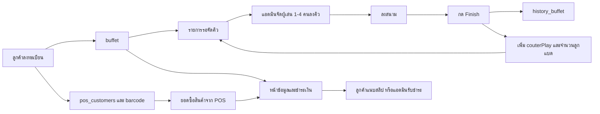
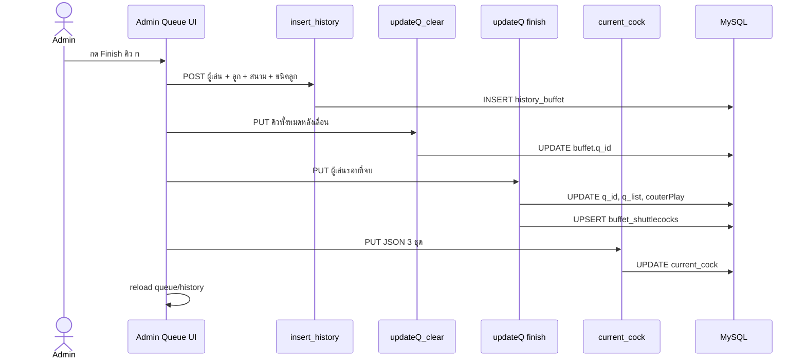
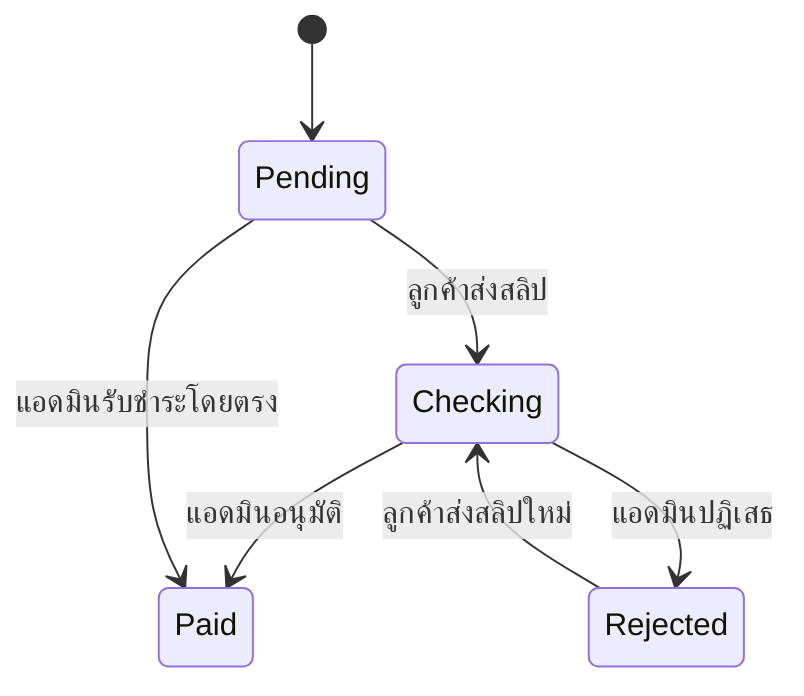
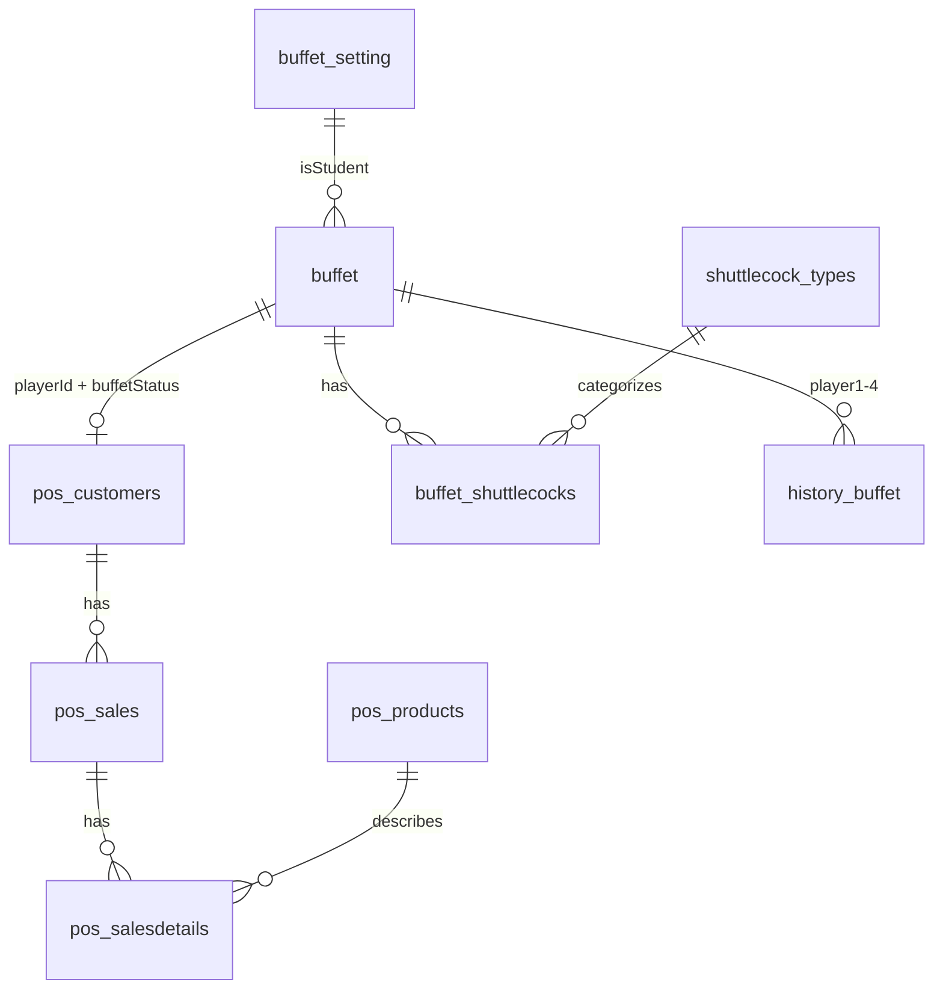

# วิเคราะห์ระบบจองบุฟเฟต์และการจัดตารางคิว

> เอกสารนี้วิเคราะห์จาก source code ปัจจุบัน เพื่อใช้เป็นฐานสำหรับออกแบบ แก้ไข และพัฒนาระบบต่อ โดยครอบคลุมเส้นทางหลัก `/admin/backend/booking/buffet/reserved`, `/admin/backend/booking/buffet`, `/booking/buffet/queue`, `/booking/buffet/info` และ flow การลงทะเบียนที่เป็นต้นทางของข้อมูล

## 1. ขอบเขตและข้อจำกัดของการวิเคราะห์

- วิเคราะห์จากโค้ด Next.js Pages Router, API Routes และคำสั่ง SQL ที่อยู่ใน repository นี้
- วิเคราะห์ทั้งหน้าบ้าน หลังบ้าน API การคำนวณราคา การเชื่อม POS และโครงสร้างข้อมูลที่อนุมานได้
- ไม่มีไฟล์ schema หรือ migration ของฐานข้อมูลใน repository จึงระบุโครงสร้างตารางจาก SQL ที่ใช้งานจริง ฟิลด์ กุญแจ และ default บางรายการยังต้องยืนยันกับฐานข้อมูลจริง
- วันที่และเวลาทั้งระบบยึดเขตเวลา `Asia/Bangkok`
- ระบบปัจจุบันรองรับการจองและแสดงคิวของ “วันปัจจุบัน” เป็นหลัก

## 2. ภาพรวมระบบปัจจุบัน

ระบบแบ่งเป็น 5 งานหลักที่เชื่อมข้อมูลชุดเดียวกัน

1. ลูกค้าลงทะเบียนตีบุฟเฟต์ของวันปัจจุบัน
2. ระบบสร้างข้อมูลผู้เล่นและลูกค้า POS พร้อม barcode
3. แอดมินลากผู้เล่นจากรายการรอไปจัดเป็นแมตช์/คิว คิวละไม่เกิน 4 คน
4. เมื่อจบรอบ ระบบบันทึกประวัติ เพิ่มจำนวนรอบและจำนวนลูกแบดที่ผู้เล่นแต่ละคนต้องรับผิดชอบ แล้วนำผู้เล่นกลับไปรายการรอ
5. หลังเล่นเสร็จ ลูกค้าหรือแอดมินชำระค่าสนาม ค่าลูกแบด และสินค้าจาก POS



แนวคิดสำคัญของ implementation ปัจจุบันคือ `buffet` เป็นทั้งข้อมูลการจอง ผู้เล่น สถานะคิว ยอดใช้งาน และสถานะชำระเงินใน record เดียว ส่วนสถานะที่ทำให้ผู้เล่นแสดงในคิวไม่ได้มาจาก queue status โดยตรง แต่ใช้เงื่อนไขการชำระเงินร่วมกัน

## 3. Route และหน้าที่ของแต่ละหน้า

### 3.1 `/admin/backend/booking/buffet/reserved`

ไฟล์หลัก: `pages/admin/backend/booking/buffet/reserved.tsx`

หน้ารวมรายการจองและจัดการข้อมูลย้อนหลัง มีความสามารถดังนี้

- แสดงรายการจากตาราง `buffet` ทุกวัน ไม่จำกัดเฉพาะวันนี้
- pagination ครั้งละ 15 รายการ
- ค้นหาด้วยชื่อเล่น เบอร์โทร หรือข้อความวันที่เล่น โดย debounce 500 ms
- แสดงสถานะการชำระเงิน
- เปิดดูและอนุมัติ/ปฏิเสธสลิป
- แก้ชื่อเล่น เบอร์โทร ประเภทผู้เล่น วันที่เล่น และวันที่ชำระเงิน
- เพิ่ม/ลดจำนวนลูกแบดแยกตามชนิด โดยมีผลกับฐานข้อมูลทันทีหลัง debounce 500 ms
- ดูค่าลูก ค่าสนาม ยอดสินค้าจาก POS และยอดรวม
- รับชำระผ่านการโอนโดยแอดมิน
- ลบรายการจอง

สถานะที่แสดงในตาราง

| `paymentStatus` | ความหมาย | สีที่ใช้ |
|---:|---|---|
| 0 | ยังไม่ชำระ | แดงอ่อน |
| 1 | รอตรวจสอบ | เหลือง |
| 2 | ชำระแล้ว | เขียวอ่อน |
| 3 | สลิปไม่ถูกต้อง | แดงอ่อน |

การเปิด modal แก้ไขจะเรียกข้อมูลใหม่จาก `/api/admin/buffet/get/get_by_id` เพื่อคำนวณยอดจากข้อมูลล่าสุด ไม่ได้ใช้ยอดจากแถวในตารางโดยตรง

### 3.2 `/admin/backend/booking/buffet`

ไฟล์หลัก: `pages/admin/backend/booking/buffet/index.tsx`

เป็นหน้าปฏิบัติงานหลักสำหรับจัดคิวของวันปัจจุบัน แบ่งหน้าจอเป็น

- คิวการเล่น 30 แถว (`T0` ถึง `T29`) ซึ่งแสดงต่อผู้ใช้เป็นคิว 1 ถึง 30
- รายการ “รอจัดคิว”
- ประวัติรอบที่เล่นเสร็จในวันนี้
- รายชื่อผู้เล่นทั้งหมดที่ยัง active เพื่อเปิด modal ค่าบริการ/สินค้า

ความสามารถหลัก

- ลากผู้เล่นจากรายการรอเข้าแต่ละคิว
- จำกัดจำนวนผู้เล่นในคิวไม่เกิน 4 คน
- ลากสลับตำแหน่งผู้เล่นภายในคิวหรือย้ายระหว่างคิว
- ตั้งจำนวนลูกแบด ชนิดลูกแบด และหมายเลขสนามแยกต่อคิว
- กด `Finish` เพื่อปิดรอบ บันทึกประวัติ และเลื่อนคิวถัดไปขึ้นมา
- double-click ผู้เล่นเพื่อแก้ระดับมือ
- เปิดรายละเอียดผู้เล่นเพื่อเพิ่ม/ลดลูกแบด ดูยอด POS รับชำระ หรือกำหนดว่าเล่นเสร็จแต่ยังไม่ชำระ
- กรองรายชื่อผู้เล่นด้วยชื่อเล่น

สีของผู้เล่นในหน้าคิว

| ประเภท | `isStudent` | สี |
|---|---:|---|
| บุคคลทั่วไป | `0` | ขาว |
| นักเรียน | `1` | เขียวอ่อน |
| นักศึกษา | `2` | ส้มอ่อน |

### 3.3 `/booking/buffet/queue`

ไฟล์หลัก: `pages/booking/buffet/queue/index.tsx`

เป็นหน้าจอสาธารณะสำหรับดูคิวปัจจุบัน มีโครงสร้างคล้ายหน้าจัดคิวหลังบ้าน แต่เป็น read-only

- แสดงคิว 1 ถึง 30
- แสดงผู้เล่นในแต่ละคิวและรายการรอ
- แสดงชื่อ ระดับมือ และจำนวนรอบที่เล่นแล้วในรูป `ชื่อ - จำนวนรอบ (ระดับมือ)`
- แสดงจำนวนลูก ชนิดลูก และสนามของแต่ละคิว
- แสดงประวัติรอบของวันนี้
- คลิกชื่อผู้เล่นเพื่อดูจำนวนลูกแบดสะสมแยกตามชนิดและยอดค่าลูก
- refresh อัตโนมัติทุก 10 วินาที
- ในแต่ละรอบ polling จะดึงข้อมูลผู้เล่น ประวัติ และตัวเลือกประจำคิวหลาย request

แม้ component จะใช้ `react-beautiful-dnd` แต่ปิดการลากทั้งหมด และ `onDragEnd` ไม่มี logic จึงทำหน้าที่แสดงผลเท่านั้น

### 3.4 `/booking/buffet/info`

ไฟล์หลัก: `pages/booking/buffet/info.tsx`

หน้าสาธารณะสำหรับค้นหารายการจองของวันนี้และชำระเงิน

- แสดงรายการวันนี้ครั้งละ 15 รายการ
- ค้นหาด้วยชื่อเล่นหรือ barcode โดย debounce 500 ms
- แสดง barcode ชื่อเล่น และสถานะชำระเงิน
- เปิดรายละเอียดเพื่อดูค่าสนาม ค่าลูกแยกชนิด ยอดสินค้าจาก POS และยอดรวม
- เปิดดูรายละเอียดสินค้าที่ซื้อจาก POS
- แสดง QR สำหรับชำระเงินจาก static file `/QR_Buffet.jpg`
- เลือกภาพสลิป ดู preview ยืนยัน และ upload ไป Cloudinary
- ห้ามส่งสลิปใหม่ระหว่างรอตรวจสอบหรือเมื่อชำระแล้ว
- กรณีสลิปถูกปฏิเสธ สามารถส่งสลิปใหม่ได้
- มีข้อความกำกับให้ชำระหลังเล่นเสร็จแล้ว

### 3.5 ต้นทางข้อมูล `/booking/buffet`

แม้ไม่ใช่หนึ่งในหน้าหลักที่ใช้จัดคิว แต่เป็นต้นทางของ flow การจอง จึงมีผลโดยตรงต่อทั้ง 4 หน้าข้างต้น

- รับชื่อเล่นสูงสุด 10 ตัวอักษร
- รับเบอร์โทร 10 หลักและกำหนด pattern ให้ขึ้นต้นด้วย 0
- เลือกระดับมือ
- เลือกประเภทบุคคลทั่วไป นักเรียน หรือนักศึกษา
- แสดงค่าสนามตามประเภทผู้เล่น
- แสดงชนิดลูกแบดที่เปิดใช้งานและราคาที่หาร 4 ต่อคน
- บันทึกวันที่ใช้งานเป็นวันปัจจุบันเท่านั้น
- ตรวจชื่อเล่นซ้ำในวันเดียวกันจากฝั่ง client
- เมื่อบันทึกสำเร็จ แสดง barcode และเสนอให้ไปหน้าข้อมูล

## 4. กติกาการเข้าและออกจากหน้าคิว

API ของหน้าคิวทั้ง public และ admin เลือกเฉพาะ record ที่ตรงกับเงื่อนไขต่อไปนี้

```text
usedate = วันที่ปัจจุบันในรูป dd MMMM yyyy
AND paymethod_shuttlecock = '0'
AND paymentStatus = 0
```

ผลที่เกิดขึ้น

- ผู้สมัครใหม่ที่ใช้ default `paymethod_shuttlecock = 0` และ `paymentStatus = 0` จะเข้ารายการคิวของวันนี้
- เมื่อแอดมินรับชำระ สถานะจะเปลี่ยนเป็นชำระแล้วและ record หายจากคิว
- เมื่อแอดมินกด “เล่นเสร็จแล้ว” `paymethod_shuttlecock` จะเป็น `4` และ record หายจากคิว
- เมื่อลูกค้าส่งสลิป `paymethod_shuttlecock` จะเป็น `3` และ `paymentStatus` เป็น `1` จึงหายจากคิว
- ระบบไม่มี field `queue_status` หรือ `booking_status` แยกเฉพาะ การอยู่ในคิวจึงผูกกับสถานะการชำระเงินและวิธีชำระเงินโดยอ้อม

นี่เป็น coupling สำคัญ หากในอนาคตต้องให้ลูกค้าจ่ายก่อนเล่น ให้ผู้เล่นพักชั่วคราว หรือกลับเข้าคิวหลังชำระแล้ว จะทำไม่ได้ตรงไปตรงมาโดยไม่แก้ query และ state model

## 5. กลไกจัดคิวปัจจุบัน

### 5.1 ความหมายของฟิลด์คิว

| ฟิลด์ | ความหมายจากโค้ด |
|---|---|
| `q_id` | index ของคิวในระบบ เริ่ม 0; `NULL` หมายถึงอยู่รายการรอ |
| `q_list` | ลำดับภายในคิว หรือลำดับในรายการรอ |
| `couterPlay` | จำนวนรอบที่เล่นแล้ว ชื่อฟิลด์สะกดตามระบบปัจจุบัน |
| `skillLevel` | ระดับมือที่ใช้ประกอบการจัดคู่ |
| `T_value` | ค่าจาก `current_buffet_q` แต่แทบไม่ได้ถูกใช้ใน UI ปัจจุบัน |

### 5.2 การโหลดคิว

1. ดึงผู้เล่น active ของวันนี้
2. ผู้เล่นที่ `q_id IS NULL` เข้า `rightItems.tasks` หรือรายการรอ
3. ผู้เล่นที่ `q_id = 0..29` เข้า `T0..T29`
4. แต่ละกลุ่มเรียงด้วย `q_list` จากน้อยไปมาก
5. UI แสดง `nickname - couterPlay (skillLevel)`

### 5.3 การลากผู้เล่น

- ภายในปลายทางเดียวกัน: เปลี่ยนลำดับ array และบันทึก `q_list`
- ย้ายข้ามคิว: ตัดผู้เล่นจาก source และแทรกที่ destination
- ถ้าปลายทางเป็นคิว รับได้เมื่อมีผู้เล่นน้อยกว่า 4 คน
- ถ้าปลายทางเป็นรายการรอ ไม่จำกัดจำนวน
- API `/api/admin/buffet/updateQ` อัปเดต `q_id` และ `q_list` ของรายการที่ส่งมา

### 5.4 ค่าประจำคิว

แต่ละคิวมีค่า 3 ชุดที่เก็บเป็น JSON array ในตาราง `current_cock`

| row id ที่ UI ใช้ | ค่า |
|---:|---|
| 1 | จำนวนลูกแบดของรอบ |
| 2 | หมายเลขสนาม |
| 3 | id ชนิดลูกแบด |

ตัวอย่างเชิงแนวคิด

```json
{
  "selected_options": ["2", "1", "0", "", ""]
}
```

index ของ array ตรงกับ `q_id` จึงเป็นค่ากลางทั้งระบบ ไม่ได้ผูกกับวันที่หรือ match id

### 5.5 การกด Finish

เมื่อแอดมินกด Finish ที่คิว index `n` หน้าเว็บทำงานตามลำดับนี้

1. copy คิว `n+1..29` เลื่อนขึ้นมาเป็น `n..28`
2. ล้างคิวสุดท้าย
3. นำผู้เล่นของคิวที่จบกลับไปต่อท้ายรายการรอใน local state
4. เพิ่ม `couterPlay` ของผู้เล่นกลุ่มที่จบคนละ 1 ใน local state
5. บันทึก snapshot ลง `history_buffet` สูงสุด 4 คน พร้อมจำนวนลูก สนาม ชนิดลูก วันที่ และเวลา
6. เรียก `/api/admin/buffet/updateQ_clear` เพื่อแก้ `q_id` ของผู้เล่นในคิวที่ถูกเลื่อน
7. เรียก `/api/admin/buffet/updateQ?...finish=true` สำหรับผู้เล่นที่จบ เพื่อ
   - กำหนด `q_id = NULL`
   - เพิ่ม `couterPlay = couterPlay + 1`
   - เพิ่มจำนวนลูกที่เลือกให้ผู้เล่นทุกคนเท่ากันใน `buffet_shuttlecocks`
8. เลื่อน JSON array ของจำนวนลูก สนาม และชนิดลูก แล้วบันทึกกลับ `current_cock`
9. โหลดคิวและประวัติใหม่



การทำงานนี้ยังไม่เป็น atomic transaction หาก request ใด request หนึ่งล้มเหลว จะเกิดประวัติ จำนวนลูก จำนวนรอบ คิว และค่าประจำคิวไม่ตรงกันได้

## 6. การคิดค่าบริการ

### 6.1 แหล่งราคา

- ค่าสนามต่อคน: `buffet_setting.court_price` แยกตาม `isStudent`
- ราคาลูกต่อหนึ่งลูก: `shuttlecock_types.price`
- ผู้เล่นหนึ่งคนรับผิดชอบ 1/4 ของราคาลูกที่ใช้ในรอบ
- ยอดสินค้า: ผลรวม `pos_sales.TotalAmount` ของ `pos_customers` ที่ผูกกับผู้เล่น

### 6.2 สูตรหลัก

```text
ค่าลูกของผู้เล่น
= SUM(buffet_shuttlecocks.quantity × shuttlecock_types.price) ÷ 4

ยอดรวม
= buffet_setting.court_price
 + ค่าลูกของผู้เล่น
 + SUM(pos_sales.TotalAmount ที่ไม่ถูกลบ)
```

ตัวอย่าง

- ค่าสนาม 150 บาท
- ลูกชนิด A ราคา 100 บาท ใช้สะสม 3 ลูก
- ลูกชนิด B ราคา 120 บาท ใช้สะสม 2 ลูก
- ซื้อสินค้าจาก POS 80 บาท

```text
ค่าลูก = (3 × 100 ÷ 4) + (2 × 120 ÷ 4) = 135 บาท
ยอดรวม = 150 + 135 + 80 = 365 บาท
```

### 6.3 ความไม่สอดคล้องที่มีอยู่

- หน้าและ API รุ่นใหม่คำนวณค่าลูกจาก `buffet_shuttlecocks` และ `shuttlecock_types`
- ยังมี field เก่า `buffet.shuttle_cock` และ `buffet_setting.shuttle_cock_price` ถูกอ้างในบางจุด
- state `price` ใน `/booking/buffet/info` ยังคำนวณด้วย field เก่า แต่ UI ยอดสุดท้ายแสดง `total_price` จาก API
- ตอนลูกค้า upload สลิป `buffet.price` ถูกบันทึกเฉพาะค่าสนามและค่าลูก ไม่รวมยอดสินค้า POS แม้หน้าจอจะแสดงยอดรวมที่รวมสินค้า
- `shoppingMoney` ใน admin detail บาง query รวมรายการที่ `flag_delete = true` แต่ `total_price` ไม่นับรายการที่ถูกลบ ทำให้ “ยอดซื้อของ” กับ “ยอดรวม” อาจดูไม่สัมพันธ์กัน

## 7. สถานะการชำระเงิน

### 7.1 `buffet.paymentStatus`

| ค่า | enum | ความหมาย |
|---:|---|---|
| 0 | `PENDING` | ยังไม่ชำระ |
| 1 | `CHECKING` | ส่งสลิปแล้ว รอตรวจสอบ |
| 2 | `PAID` | ชำระแล้ว |
| 3 | `REJECT` | สลิปไม่ถูกต้อง |

### 7.2 `buffet.paymethod_shuttlecock`

| ค่า | enum | ความหมาย |
|---:|---|---|
| 0 | `NONE` | ยังไม่มีวิธีชำระ |
| 1 | `TRANSFER_ADMIN` | โอนผ่านแอดมิน |
| 2 | `CASH_ADMIN` | เงินสดผ่านแอดมิน แต่ปุ่มถูกซ่อนใน UI |
| 3 | `TRANSFER_CUSTOMER` | ลูกค้าโอนและแนบสลิปเอง |
| 4 | `FINISH_PLAY` | เล่นเสร็จแต่ยังไม่ชำระ |
| 5 | `PAY_BY_POS` | ชำระผ่าน POS |

`paymethod_shuttlecock` ปัจจุบันปะปนทั้ง “วิธีชำระ” และ “สถานะการเล่น” เพราะค่า `FINISH_PLAY` ไม่ใช่วิธีชำระเงินจริง

### 7.3 Flow ลูกค้าส่งสลิป

1. ลูกค้าเปิดรายละเอียดจาก `/booking/buffet/info`
2. เลือกไฟล์ภาพและยืนยัน
3. API upload ไฟล์ไป Cloudinary
4. อัปเดต `buffet`
   - `paymentSlip = secure_url`
   - `price = ค่าสนาม + ค่าลูก`
   - `paymentStatus = CHECKING`
   - `pay_date = วันนี้`
   - `paymethod_shuttlecock = TRANSFER_CUSTOMER`
5. อัปเดต `pos_customers` เป็น `checking` พร้อม URL สลิป ยอดสนาม และ `pay_by = transfer`
6. แอดมินเปิดสลิปที่หน้า reserved แล้วอนุมัติหรือปฏิเสธ

### 7.4 Flow แอดมินรับชำระ

1. แอดมินเปิดผู้เล่นจากหน้าคิวหรือหน้า reserved
2. ระบบดึงยอดรวมล่าสุด
3. แอดมินยืนยันรับชำระผ่านการโอน
4. API อัปเดต `buffet` เป็น paid เก็บยอดรวม วันที่ชำระ และวิธีชำระ
5. ถ้ามีรายการขาย จะอัปเดต `pos_sales` เป็น Paid
6. อัปเดต `pos_customers` เป็น paid เก็บ `courtPrice`, `pay_by`, `pay_date`

### 7.5 State transition ที่ควรเป็น



สถานะการเล่นควรแยกเป็นอีก state machine เช่น `registered -> queued -> playing -> finished -> cancelled` ไม่ควรใช้ payment method ควบคุม

## 8. การเชื่อมต่อ POS และ barcode

เมื่อลงทะเบียนสำเร็จ ระบบสร้าง record ใน `pos_customers`

- `PlayerId` อ้างถึง `buffet.id`
- `phone` และ `CustomerName` copy จากการลงทะเบียน
- `buffetStatus = 'buffet'`
- barcode ใช้ค่าล่าสุดของวันนี้ + 1 ถ้าไม่มีให้เริ่มจาก `FIRST_BARCODE`

การหา POS customer ใน flow อื่นใช้คู่ `playerId + buffetStatus` จากนั้น

- ดึง `pos_sales` เพื่อรวมยอดสินค้า
- ดึง `pos_salesdetails` และ `pos_products` เพื่อแสดงรายละเอียดสินค้า
- เปลี่ยนสถานะ `pos_sales` และ `pos_customers` เมื่อรับชำระหรืออนุมัติสลิป

จุดสำคัญคือข้อมูลการจองและข้อมูลลูกค้า POS ถูกสร้าง/แก้หลาย statement แต่ยังไม่มี transaction ครอบทั้งหมด

## 9. ตารางฐานข้อมูลที่เกี่ยวข้อง

โครงสร้างต่อไปนี้เป็น logical schema ที่อนุมานจาก query ไม่ใช่ DDL ที่ยืนยันแล้ว

### 9.1 `buffet`

ฟิลด์ที่พบจากโค้ด

- `id`
- `nickname`
- `usedate`
- `phone`
- `isStudent`
- `skillLevel`
- `price`
- `shuttle_cock` ซึ่งเป็น field รุ่นเก่า
- `q_id`
- `q_list`
- `couterPlay`
- `paymentStatus`
- `paymentSlip`
- `paymethod_shuttlecock`
- `regisDate`
- `pay_date`

### 9.2 `buffet_setting`

- `id`
- `court_price`
- `shuttle_cock_price` ซึ่งยังมีการอ้างจาก flow เก่า
- `isStudent`

ระบบคาดหวังข้อมูล 3 กลุ่ม คือบุคคลทั่วไป นักเรียน และนักศึกษา

### 9.3 `shuttlecock_types`

- `id`
- `code`
- `name`
- `price`
- `isActive`
- `created_at`
- `updated_at`

### 9.4 `buffet_shuttlecocks`

- `buffet_id`
- `shuttlecock_type_id`
- `quantity`

จาก `ON DUPLICATE KEY` คาดว่าต้องมี unique key อย่างน้อย `(buffet_id, shuttlecock_type_id)`

### 9.5 `history_buffet`

- `id`
- `player1_id`
- `player2_id`
- `player3_id`
- `player4_id`
- `shuttle_cock`
- `shuttlecock_type_id`
- `court`
- `usedate`
- `time`

### 9.6 `current_cock`

- `id`
- `selected_options` เป็น JSON string

UI คาดหวังอย่างน้อย 3 row และอาศัยทั้งลำดับผลลัพธ์และ id 1, 2, 3

### 9.7 `current_buffet_q`

- `id`
- `T_value`

ถูก join ด้วย `buffet.q_id = current_buffet_q.id` แต่ค่า `T_value` แทบไม่ได้ถูกใช้ในหน้าปัจจุบัน

### 9.8 ตาราง POS

- `pos_customers`
- `pos_sales`
- `pos_salesdetails`
- `pos_products`



## 10. API inventory

### 10.1 Public API

| Method | Endpoint | หน้าที่ |
|---|---|---|
| POST | `/api/buffet/add` | สมัครและสร้าง POS customer/barcode |
| PUT | `/api/buffet/add` | upload สลิปและเปลี่ยนสถานะเป็น checking |
| GET | `/api/buffet/get` | รายการวันนี้แบบ pagination/search |
| GET | `/api/buffet/getone?id=` | รายละเอียดและยอดรวมของผู้เล่น |
| GET | `/api/buffet/getRegis` | ผู้เล่น active และตำแหน่งคิววันนี้ |
| GET | `/api/buffet/get_history` | ประวัติรอบวันนี้ |
| GET | `/api/buffet/get_regis_by_id?id=` | จำนวนลูกและข้อมูลคิวของผู้เล่น |
| GET | `/api/buffet/save-selected-options` | ค่าลูก/สนาม/ชนิดลูกของทุกคิว |
| GET | `/api/buffet/check_nick_name` | ตรวจชื่อเล่นซ้ำในวันที่กำหนด |
| GET | `/api/buffet/get_setting` | ราคา buffet settings |
| GET | `/api/buffet/get_shuttlecock_types` | ชนิดลูกที่ active |
| GET | `/api/get-by-customer` | รายการขายและรายละเอียดสินค้าของผู้เล่น |

### 10.2 Admin API

Admin API กลุ่มนี้ตรวจ NextAuth token ใน handler

| Method | Endpoint | หน้าที่ |
|---|---|---|
| GET | `/api/admin/buffet/getRegis` | ผู้เล่น active สำหรับหน้าจัดคิว |
| PUT | `/api/admin/buffet/updateQ` | อัปเดตคิว ลำดับ จำนวนรอบ และจำนวนลูก |
| PUT | `/api/admin/buffet/updateQ_clear` | อัปเดต q_id หลังเลื่อนคิว |
| POST | `/api/admin/buffet/insert_history` | บันทึกประวัติรอบ |
| GET/PUT | `/api/admin/buffet/save-selected-options` | อ่าน/เขียนค่าประจำคิว |
| PUT | `/api/admin/buffet/updateSkillLevel` | แก้ระดับมือ |
| PUT | `/api/admin/buffet/add_reduce` | กำหนดจำนวนลูกของผู้เล่นตามชนิด |
| PUT | `/api/admin/buffet/finishPlay` | ตั้งว่าเล่นเสร็จแต่ยังไม่ชำระ |
| PUT | `/api/admin/buffet/pay_shuttle_cock` | รับชำระและ sync POS |
| PUT | `/api/admin/buffet/update_status` | อนุมัติ/ปฏิเสธสลิปและ sync POS |
| GET | `/api/admin/buffet/get/getall` | รายการทั้งหมดแบบ pagination/search |
| GET | `/api/admin/buffet/get/get_by_id` | รายละเอียดและยอดรวมล่าสุด |
| PUT/DELETE | `/api/admin/buffet/updateData` | แก้ไขหรือลบรายการ |
| GET | `/api/admin/buffet/get_shuttlecock_types` | ชนิดลูกทั้งหมดสำหรับ admin |
| PUT | `/api/admin/buffet/edit_shuttlecock_type` | แก้ code, name, price, active |
| GET/PUT | `/api/admin/buffet_setting` | อ่าน/แก้ค่าสนามตามประเภทผู้เล่น |

หน้า `/admin/:path*` ถูกป้องกันด้วย NextAuth middleware และ admin APIs ที่เกี่ยวข้องตรวจ token ซ้ำ อย่างไรก็ตาม public APIs ไม่มี authentication หรือ authorization ตามวัตถุประสงค์ของหน้าสาธารณะ

## 11. จุดเสี่ยงและข้อบกพร่องที่พบ

### 11.1 ระดับวิกฤต

#### A. ปฏิเสธสลิปแต่ POS sales ถูกตั้งเป็น Paid

ใน `/api/admin/buffet/update_status` การ update `pos_sales` ส่งค่า `paymentStatusEnum.Paid` เสมอ ไม่ว่าจะอนุมัติหรือปฏิเสธสลิป ขณะที่ `pos_customers` ใช้สถานะตาม request

ผลกระทบ

- สลิปถูกปฏิเสธ แต่รายการขายอาจถูกบันทึกว่าชำระแล้ว
- รายงาน POS และยอดค้างชำระไม่ตรงกับสถานะลูกค้า
- การแก้ย้อนหลังยากเพราะหลายตารางมีคนละสถานะ

แนวทางแก้

- map `PAID` เฉพาะกรณีอนุมัติ
- กรณี reject ให้ `pos_sales` กลับเป็น `Pending` และล้าง `pay_by/pay_date` ตามกติกาธุรกิจ
- ครอบ update `buffet`, `pos_customers`, `pos_sales` ด้วย transaction เดียว

#### B. การ Finish คิวไม่เป็น transaction

การจบรอบประกอบด้วย history, queue shift, counter, shuttlecock และ config หลาย API หากขั้นใดล้มเหลว ข้อมูลจะไม่สอดคล้องกัน

ตัวอย่าง

- มีประวัติรอบ แต่จำนวนลูกผู้เล่นไม่เพิ่ม
- ผู้เล่นกลับรายการรอแล้ว แต่ `couterPlay` ไม่เพิ่ม
- คิวถูกเลื่อน แต่ค่าลูก/สนามยังเป็นของคิวเดิม
- request ซ้ำทำให้จำนวนลูกและจำนวนรอบเพิ่มซ้ำ

แนวทางแก้คือรวมเป็น `POST /api/admin/buffet/matches/:queueId/finish` หนึ่ง endpoint ใช้ DB transaction และ idempotency key

#### C. ลำดับรายการรอมีโอกาสซ้ำหลัง Finish

ก่อนส่งผู้เล่นที่จบกลับรายการรอ โค้ดกำหนด `q_list` ของกลุ่มนั้นใหม่เป็น 1..4 และ API update เฉพาะผู้เล่นกลุ่มที่จบ ไม่ได้ reindex รายการรอเดิมทั้งหมด จึงเกิด `q_list` ซ้ำและลำดับหลัง refresh ไม่แน่นอน

แนวทางแก้

- คำนวณ `max(q_list)` ของรายการรอแล้วต่อท้าย
- หรือ reindex ผู้เล่นรายการรอทั้งหมดใน transaction
- ระยะยาวใช้ queue entry ที่มี `position` และ unique constraint ต่อ session/date

#### D. การสมัครและสร้าง POS customer ไม่เป็น transaction

`buffet` ถูก insert ก่อน `pos_customers` หากขั้นที่สองล้มเหลวจะเหลือการจองที่ไม่มี POS customer/barcode และการสร้าง barcode ด้วย “ค่าล่าสุด + 1” มี race condition เมื่อสมัครพร้อมกัน

แนวทางแก้

- transaction ครอบ insert ทั้งสองตาราง
- ใช้ auto-increment/sequence หรือ atomic counter สำหรับ barcode
- เพิ่ม unique constraint และ retry เมื่อชนกัน

### 11.2 ระดับสูง

#### E. Reorder ภายในคิวทำงานจริงเฉพาะคิวแรก

ใน loop ของ `onDragEnd` มี `break` หลังตรวจรอบแรกเสมอ จึงประมวลผล reorder ภายใน `left-0` ได้ แต่คิวอื่นไม่ถูกบันทึกตามที่คาด

#### F. Source queue ไม่ถูก reindex เมื่อย้ายข้ามคิว

เมื่อย้ายผู้เล่นข้าม container API ได้รายการ destination เท่านั้น source ที่เหลือจึงเก็บ `q_list` เก่าและอาจมีช่องว่าง แม้การ sort ยังพอแสดงลำดับเดิมได้ แต่ข้อมูลไม่ canonical

#### G. ไม่มี validation ก่อน Finish

ระบบอนุญาตให้จบรอบที่มีผู้เล่นน้อยกว่า 4 คน ไม่มีสนาม ไม่มีจำนวนลูก หรือไม่มีชนิดลูก และเลือกชนิดลูกแรกเป็น default หากยังไม่เลือก ถ้ารายการชนิดลูกยังโหลดไม่สำเร็จ มีโอกาสอ่าน `shuttleCockTypes[0].id` แล้ว error

#### H. ค่า `current_cock` เป็น global state ที่ไม่ผูกวันที่

- ค่าคิวค้างข้ามวันได้
- อาศัย row order โดยไม่มี `ORDER BY`
- public API parse JSON ทุก row โดยไม่มี fallback
- หากมี row หายหรือ JSON เสีย ทั้งหน้าคิวอาจ error
- ไม่สามารถมีหลาย buffet session พร้อมกัน

#### I. ราคา settings อาศัยลำดับ row โดยไม่มี `ORDER BY`

ทั้ง server-side props และหน้า setting คาดว่า `data[0]`, `data[1]`, `data[2]` คือบุคคลทั่วไป นักเรียน นักศึกษา แต่ query ไม่มี `ORDER BY` และไม่ได้ map ด้วย `isStudent` จึงมีโอกาสใช้ราคาผิดกลุ่ม

#### J. Upload สลิปบันทึกยอดไม่ตรงยอดที่แสดง

ยอดที่แสดงรวม POS แต่ `buffet.price` และ `pos_customers.courtPrice` ตอน upload ใช้เฉพาะค่าสนาม + ค่าลูก ควรกำหนดนิยาม field ให้ชัดว่าเป็น `court_and_shuttle_total` หรือ `grand_total` และคำนวณจาก service เดียวกัน

#### K. ข้อมูลสำคัญอัปเดตหลายตารางโดยไม่มี rollback

พบใน flow อนุมัติสลิป รับชำระ แก้ข้อมูล และสมัคร หาก statement กลางทาง fail บางตารางจะถูกแก้ไปแล้ว

### 11.3 ระดับกลาง

#### L. วันที่เก็บเป็นข้อความภาษาธรรมชาติ

ระบบใช้รูป `dd MMMM yyyy` เช่น `22 July 2026` แล้วค้นหาด้วย string ทำให้

- sort และ range query ยาก
- index ใช้งานได้ไม่ดี
- parse ด้วย `new Date(...)` แตกต่างตาม environment
- รองรับภาษา/locale และ timezone ยาก

ควรเก็บวันใช้งานเป็น MySQL `DATE` และ timestamp เป็น UTC แล้ว format ที่ขอบ UI

#### M. ตรวจชื่อซ้ำเฉพาะ client

API สมัครไม่ได้ตรวจซ้ำ และไม่มีหลักฐาน unique constraint จึง bypass ได้หรือเกิด race ระหว่างผู้สมัครสองคน ควร validate server-side และกำหนดกติกาว่าซ้ำแบบ case-insensitive/trim หรือไม่

#### N. การ upload ใช้ callback แต่ release connection ใน outer finally

`multiparty.form.parse` ทำงานผ่าน async callback ขณะที่ `connection.release()` อยู่ใน `finally` ด้านนอก จึงมีโอกาสคืน connection เข้า pool ก่อน callback ใช้งานเสร็จ ควร promisify parse แล้วเปิด/คืน connection ภายในช่วงที่ query ทำงานจริง

#### O. ไม่มี server-side validation ที่เป็นระบบ

หลาย API รับ id, array, quantity, status และราคาแล้วนำไปใช้ทันที ควรตรวจ

- method
- ชนิดและช่วงค่า
- quantity ต้องเป็น integer และไม่ติดลบ
- ผู้เล่นต้องอยู่ session วันนี้
- คิวต้องอยู่ 0..29 และมีไม่เกิน 4 คน
- state transition ต้องถูกต้อง
- ยอดเงินต้องคำนวณที่ server ห้ามเชื่อยอดจาก client

#### P. Public IDOR และการเปิดเผยข้อมูล

public APIs รับ `id` แล้วคืนรายละเอียดผู้เล่น/ยอด หรือรับ upload สลิปโดยไม่มี ownership proof หน้า info ยังแสดงรายชื่อและ barcode ของทุกคนในวันนี้ เรื่องนี้อาจเป็น requirement สำหรับ kiosk แต่ควรประเมิน privacy และการปลอม upload

ทางเลือก

- ใช้ booking lookup token ที่เดายาก
- ยืนยัน barcode + เบอร์ท้าย
- แยก kiosk mode ที่จำกัด network
- คืนข้อมูลเท่าที่จำเป็นและทำ rate limit

#### Q. การลบไม่จัดการข้อมูลที่เชื่อมกันอย่างชัดเจน

DELETE ลบเฉพาะ `buffet` ไม่เห็นการจัดการ `pos_customers`, `buffet_shuttlecocks`, history และ sales จึงขึ้นกับ foreign key ที่ไม่ปรากฏใน repo อาจลบไม่สำเร็จ เหลือ orphan หรือทำลายประวัติ

ควรเปลี่ยนเป็น soft delete/cancel พร้อม audit log มากกว่าลบถาวร

#### R. คำสั่งรับเงินสดมี enum และ API รองรับ แต่ปุ่มถูก `hidden`

ต้องยืนยันว่าธุรกิจเลิกรับเงินสดจริง หรือ UI ถูกซ่อนไว้ชั่วคราว เพื่อไม่ให้ implementation และรายงานรองรับสถานะที่ผู้ใช้เลือกไม่ได้

### 11.4 ระดับต่ำ/หนี้เทคนิค

- `couterPlay` สะกดผิด ควร migrate เป็น `counter_play` หรือ `play_count`
- มี type definition ของหน้าบ้าน import จากไฟล์ page หลังบ้าน ทำให้ coupling และ bundle dependency ไม่เหมาะสม
- public queue ใช้ drag-and-drop library ทั้งที่ read-only
- API response shape ไม่สม่ำเสมอ บาง endpoint คืน array บาง endpoint คืน `{data}` และบาง endpointคืน `{results}`
- error message หลายจุดไม่ตรงงาน เช่น `Error fetching holidays/time slots`
- มี field และสูตร legacy ที่ยังค้าง ทำให้ไม่ชัดว่า source of truth คืออะไร
- การ polling ไม่มี cancellation/lock ป้องกัน request ซ้อนเมื่อ network ช้า
- หน้าจัดคิวสร้าง 30 แถวตายตัวและสนาม 1..11 ตายตัวใน component
- ประวัติระบุผู้เล่นเป็น column 1..4 ทำให้ขยายจำนวนผู้เล่นต่อแมตช์ยาก
- `payment.tsx` เป็น component mock ที่ไม่มี business logic จริง ควรลบหรือระบุว่า deprecated

## 12. สถาปัตยกรรมเป้าหมายที่แนะนำ

### 12.1 แยก domain state

อย่างน้อยควรแยกสถานะต่อไปนี้

```text
booking_status: registered | checked_in | cancelled
queue_status: waiting | queued | playing | finished | paused
payment_status: pending | checking | paid | rejected | refunded
payment_method: transfer_customer | transfer_admin | cash | pos
```

ไม่ควรใช้ `payment_method` ตัดสินว่าผู้เล่นอยู่ในคิวหรือไม่

### 12.2 สร้าง session และ match ชัดเจน

โครงสร้างที่รองรับการพัฒนาต่อได้ดีกว่า

- `buffet_sessions`: วันที่ เวลา จำนวนคิว/สนาม กติกา และสถานะเปิดรับ
- `buffet_bookings`: ผู้สมัคร ประเภท ราคาเริ่มต้น และสถานะ
- `buffet_queue_entries`: booking, session, position, status
- `buffet_matches`: session, court, shuttlecock type, quantity, started_at, finished_at, status, version
- `buffet_match_players`: match, booking, team, position
- `buffet_player_shuttlecock_usage`: booking, type, quantity หรือคำนวณจาก match players
- `buffet_payments`: amount, method, slip, reviewed_by, reviewed_at, status
- `buffet_payment_items`: court, shuttlecock, POS sale references
- `audit_logs`: action, actor, before, after, timestamp

ข้อดี

- ไม่ต้องเลื่อน array 30 ชุดทุกครั้ง
- เก็บประวัติเป็น entity จริง ไม่ต้องมี player1..player4
- รองรับหลาย session และหลายวัน
- แก้/ยกเลิกแมตช์ได้โดยมี audit trail
- คำนวณยอดซ้ำและตรวจสอบย้อนหลังได้

### 12.3 Service layer ที่ควรมี

- `RegistrationService.register()` สร้าง booking + POS customer + barcode ใน transaction
- `QueueService.movePlayer()` ตรวจ capacity และแก้ source/destination ใน transaction
- `MatchService.finish()` บันทึก match, usage, play count และคืนคิวแบบ idempotent
- `PricingService.calculateBookingTotal()` เป็น source of truth เดียวสำหรับทุกหน้าและทุก payment flow
- `PaymentService.submitSlip()` และ `PaymentService.reviewSlip()` ตรวจ state transition และ sync POS ใน transaction

### 12.4 API command ที่แนะนำ

```text
POST /api/admin/buffet/sessions/:sessionId/queue/move
POST /api/admin/buffet/matches/:matchId/finish
POST /api/buffet/bookings/:token/slips
POST /api/admin/buffet/payments/:paymentId/approve
POST /api/admin/buffet/payments/:paymentId/reject
GET  /api/buffet/sessions/:sessionId/queue
GET  /api/buffet/bookings/:token/summary
```

command ควรส่ง `version` หรือ idempotency key เพื่อป้องกัน double-click, retry และการทำงานพร้อมกันหลายจอ

## 13. แนวทางพัฒนาแบบเป็นระยะ

### Phase 0: ยืนยันข้อมูลจริงก่อนแก้

- export DDL ของทุกตารางที่เกี่ยวข้อง
- ตรวจ foreign keys, indexes, unique constraints และ default values
- เก็บตัวอย่าง record ของแต่ละสถานะ
- ยืนยันกติกาธุรกิจเรื่องจ่ายก่อน/หลังเล่น เงินสด การคืนคิว และยอด POS
- สำรองฐานข้อมูลและเตรียม rollback plan

### Phase 1: แก้ความถูกต้องเร่งด่วน

- แก้ reject slip ไม่ให้ตั้ง POS sales เป็น Paid
- รวม finish queue เป็น transaction เดียว
- แก้ `q_list` ซ้ำและ reindex source/destination
- แก้ reorder ให้ทำงานทุกคิว
- validate คิว ผู้เล่น สนาม จำนวนลูก และชนิดลูกที่ server
- map settings ด้วย `isStudent` ไม่อาศัย array index
- ทำ pricing function กลางและใช้ทั้ง upload/approve/admin payment
- ทำ registration + POS customer + barcode เป็น transaction

### Phase 2: เพิ่มความปลอดภัยและความตรวจสอบได้

- ใช้ lookup token/ownership proof สำหรับหน้าข้อมูลและ upload สลิป
- rate limit public endpoints
- จำกัด file type, file size และตรวจ image จริงก่อน upload
- เพิ่ม audit log สำหรับจัดคิว แก้จำนวนลูก รับเงิน อนุมัติ ลบ และแก้ข้อมูล
- เปลี่ยน delete เป็น cancel/soft delete
- เพิ่ม role/permission สำหรับ admin APIs

### Phase 3: ปรับ model คิวและสถานะ

- เพิ่ม session, queue entry, match, match player และ payment tables
- migrate วันที่จาก string เป็น `DATE`/`DATETIME`
- แยก play status, queue status, payment status และ payment method
- migrate `history_buffet` ไป match model
- เลิกใช้ global `current_cock` และ field legacy

### Phase 4: ปรับ UX และ realtime

- ใช้ SSE/WebSocket หรือ polling endpoint เดียวที่มี version/ETag
- แสดงเวลารอโดยประมาณและสถานะสนาม
- แจ้ง conflict เมื่อแอดมินสองจอแก้คิวพร้อมกัน
- ทำ responsive queue display โดยไม่โหลด drag-and-drop ในหน้าสาธารณะ
- เพิ่ม filter วันที่/session ในหน้ารายการและประวัติ

## 14. Acceptance criteria ที่ควรใช้

### 14.1 การสมัคร

- สมัครสำเร็จต้องมีทั้ง booking, POS customer และ barcode หรือไม่มีทั้งหมด
- ชื่อเล่นซ้ำตามกติกาที่กำหนดต้องถูกปฏิเสธจาก server
- barcode ไม่ซ้ำแม้มี request พร้อมกัน
- ราคาและประเภทผู้เล่นต้อง map ด้วย key ไม่ใช่ลำดับ row

### 14.2 การจัดคิว

- ผู้เล่นหนึ่งคนอยู่ได้เพียง waiting หรือหนึ่งคิวเท่านั้น
- คิวหนึ่งมีผู้เล่นไม่เกิน 4 คน
- ทุก position ใน container เดียวกันต้องไม่ซ้ำและต่อเนื่อง
- ย้ายผู้เล่นต้องอัปเดต source และ destination แบบ atomic
- สอง admin แก้พร้อมกันต้องไม่เขียนทับโดยเงียบ

### 14.3 การจบรอบ

- finish หนึ่งครั้งสร้าง match/history เพียงหนึ่งรายการ
- play count ของผู้เล่นทุกคนเพิ่มครั้งเดียว
- จำนวนลูกเพิ่มตามชนิดและจำนวนที่ระบุครั้งเดียว
- ผู้เล่นกลับรายการรอในลำดับที่กำหนด
- คิวถัดไปและค่าประจำแมตช์ต้องตรงกัน
- ถ้าขั้นใดล้มเหลว ทุกการเปลี่ยนแปลงต้อง rollback

### 14.4 การชำระเงิน

- ยอดบนหน้าลูกค้า หน้า admin สลิป และยอดที่บันทึกต้องเท่ากัน
- ยอดต้องประกอบด้วยรายการที่ตรวจสอบย้อนกลับได้
- reject ต้องไม่ทำให้ booking, customer หรือ sale ใดเป็น paid
- approve ซ้ำต้องไม่ชำระหรือบันทึกซ้ำ
- POS sync ล้มเหลวต้อง rollback payment state

## 15. Test cases สำคัญ

### Queue unit/integration

1. ย้ายคนจาก waiting เข้าคิวว่าง
2. เติมคิวจาก 3 เป็น 4 คน
3. ปฏิเสธคนที่ 5
4. ย้ายคนจากคิว 1 ไปคิว 2 แล้วตรวจทั้งสองลำดับ
5. reorder ภายในคิว 2 ถึงคิว 30
6. ย้ายกลับ waiting และตรวจ position ไม่ซ้ำ
7. finish คิวที่ 1 และตรวจการเลื่อนทุกคิว
8. finish ขณะ API กลางทางล้มเหลว ต้อง rollback
9. double-click Finish ต้องเกิดผลครั้งเดียว
10. admin สองจอลากคนเดียวกันพร้อมกัน ต้องมี conflict ที่ชัดเจน

### Pricing/payment

1. บุคคลทั่วไป นักเรียน นักศึกษาได้ค่าสนามถูกชุด
2. หลายชนิดลูกและ quantity เป็นศูนย์/หลายลูก
3. มี POS sales, ไม่มี POS sales และมีรายการถูกลบ
4. upload สลิปแล้ว amount ตรงกับหน้าสรุป
5. approve แล้วทุกตารางเป็น paid
6. reject แล้วทุกตารางยัง pending/rejected ตามกติกา ไม่มี sale เป็น paid
7. ส่งสลิปใหม่หลัง reject
8. approve/reject request ซ้ำ

### Security/validation

1. public user เดา id ของผู้อื่น
2. upload ไฟล์ไม่ใช่ภาพหรือไฟล์เกินขนาด
3. quantity ติดลบ ทศนิยม หรือสูงผิดปกติ
4. q_id นอกช่วงและ payload ผู้เล่นซ้ำ
5. admin API ที่ไม่มี token
6. rate limit การค้นหา สมัคร และ upload

## 16. คำถามธุรกิจที่ต้องยืนยันก่อน redesign

1. ผู้เล่นต้องจ่ายหลังเล่นเสร็จเท่านั้น หรือจ่ายก่อนแล้วอยู่ในคิวต่อได้
2. เมื่อจบรอบ ผู้เล่นควรกลับท้ายคิวตามลำดับเดิม ตามทีม หรือตามจำนวนรอบที่เล่นน้อยที่สุด
3. อนุญาตแมตช์ 1-3 คนหรือบังคับ 4 คน
4. ลูกแบดหนึ่งลูกต้องคิดหาร 4 เสมอ แม้มีผู้เล่นไม่ครบ 4 หรือไม่
5. ผู้เล่นสามารถพัก/ออกชั่วคราวโดยยังไม่จบการใช้บริการได้หรือไม่
6. ชื่อเล่นต้องไม่ซ้ำเฉพาะวัน เฉพาะ session หรือใช้ซ้ำได้เมื่อเบอร์โทรต่างกัน
7. barcode เป็นรหัสรายวันหรือรหัสถาวร และต้อง reset เวลาใด
8. ยอด POS ทุกใบต้องรวมในการชำระ buffet หรือเลือกบางใบได้
9. การปฏิเสธสลิปควรทำอย่างไรกับยอด POS ที่เคยเปลี่ยนสถานะแล้ว
10. ต้องเก็บประวัติการย้ายคิวและผู้ดำเนินการระดับใด
11. จำนวน 30 คิวและสนาม 11 สนามเป็นค่าคงที่หรือควรตั้งค่าได้
12. ยังรับเงินสดหรือรับเฉพาะการโอน/POS

## 17. Source files หลักที่เกี่ยวข้อง

### Pages

- `pages/admin/backend/booking/buffet/index.tsx`
- `pages/admin/backend/booking/buffet/reserved.tsx`
- `pages/admin/backend/booking/buffet/ShuttleCockControl.tsx`
- `pages/booking/buffet/index.tsx`
- `pages/booking/buffet/info.tsx`
- `pages/booking/buffet/queue/index.tsx`

### API และ shared model

- `pages/api/buffet/*`
- `pages/api/admin/buffet/*`
- `pages/api/get-by-customer/index.ts`
- `pages/api/admin/buffet_setting.ts`
- `interface/buffet.ts`
- `interface/buffetSetting.ts`
- `interface/customers.ts`
- `enum/buffetPaymentStatusEnum.ts`
- `enum/paymethodShuttlecockEnum.ts`
- `enum/StudentPriceEnum.ts`
- `enum/skillLevelEnum.ts`
- `db/db.ts`
- `middleware.js`

## 18. สรุปสำหรับทีมพัฒนา

ระบบปัจจุบันใช้งาน flow หลักได้ครบตั้งแต่สมัคร จัดคิว บันทึกรอบ คิดลูก เชื่อม POS และชำระเงิน จุดที่ควรแก้ก่อนเพิ่ม feature คือความถูกต้องของ transaction และ state model โดยเฉพาะการปฏิเสธสลิป การ Finish หลาย request ลำดับ `q_list` ซ้ำ และการใช้ payment method เป็นตัวแทนสถานะการเล่น

ลำดับที่แนะนำคือแก้ข้อมูลผิดก่อน จากนั้นรวม business logic ไว้ที่ service/API ฝั่ง server แล้วจึง migrate ไป session/match/payment model การทำตามลำดับนี้จะลดความเสี่ยงที่ UI ใหม่ดูดีขึ้นแต่ยังสร้างข้อมูลคิวและยอดชำระไม่สอดคล้องกันในฐานข้อมูล
