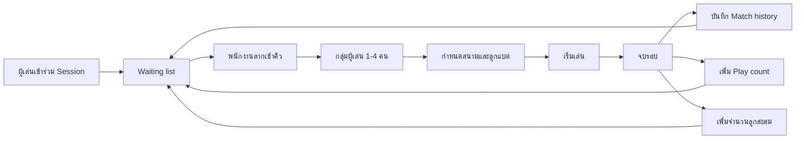
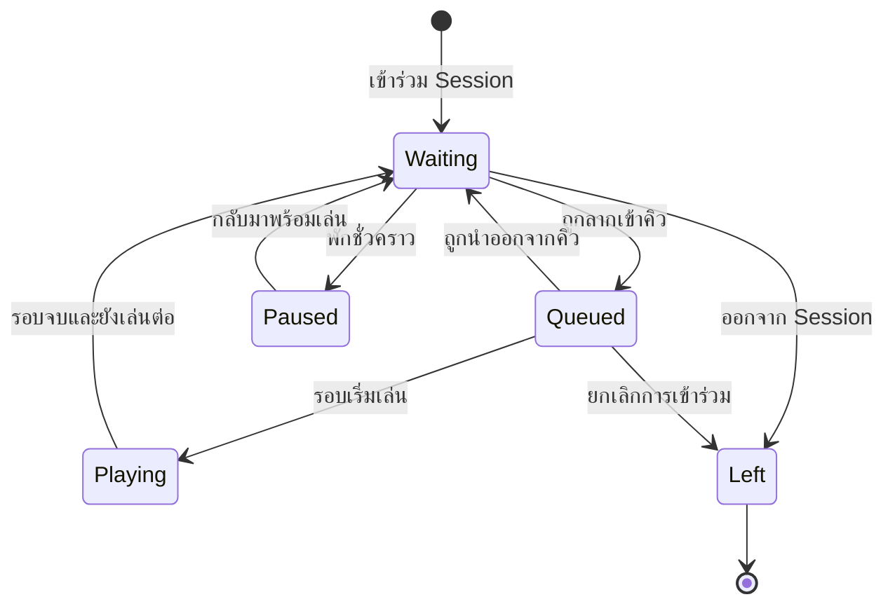
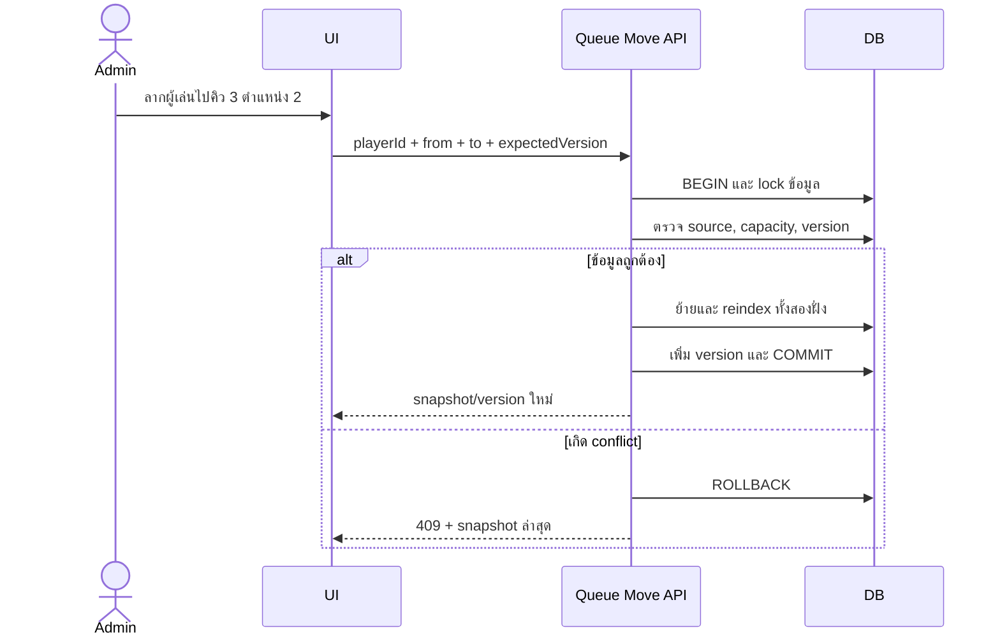
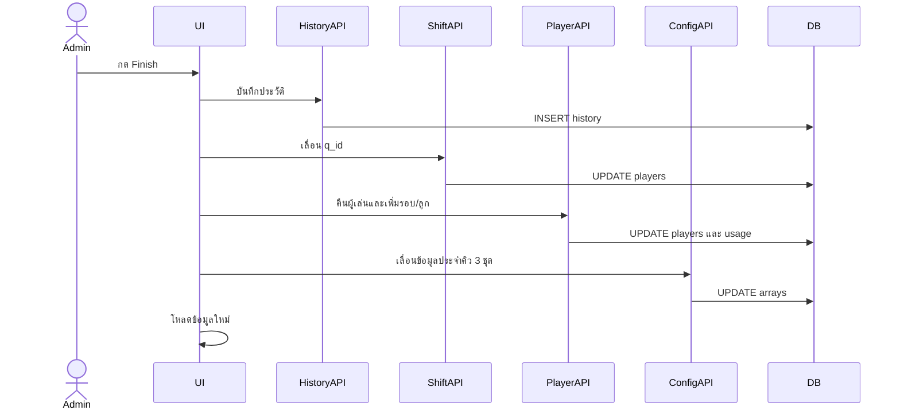

# วิเคราะห์และออกแบบระบบคิวบุฟเฟต์

> เอกสารฉบับนี้โฟกัสเฉพาะวงจรการทำงานของคิวบุฟเฟต์: รายการผู้เล่นรอ การลากวาง การจัดกลุ่มผู้เล่นลงคิว การกำหนดสนามและลูกแบด การจบรอบ ประวัติการเล่น และการนำผู้เล่นกลับเข้ารายการรอ เพื่อใช้เป็นข้อกำหนดสำหรับพัฒนาระบบคิวต่อ

## 1. เป้าหมายของระบบ

ระบบคิวบุฟเฟต์ต้องช่วยให้พนักงานจัดผู้เล่นหมุนเวียนลงสนามได้รวดเร็ว มองเห็นสถานะทั้งหมดจากหน้าจอเดียว และป้องกันข้อมูลคิวผิดพลาดเมื่อมีการลากวาง จบรอบ หรือใช้งานพร้อมกันหลายหน้าจอ

เป้าหมายหลัก

1. แสดงผู้เล่นที่พร้อมเล่นในรายการรออย่างเป็นลำดับ
2. จัดผู้เล่นลงกลุ่มได้ไม่เกิน 4 คนต่อรอบ
3. รองรับการลากวางทั้งจากรายการรอไปคิว ระหว่างคิว และกลับรายการรอ
4. กำหนดสนาม ชนิดลูกแบด และจำนวนลูกของแต่ละรอบ
5. จบรอบได้อย่างถูกต้องเพียงครั้งเดียว
6. บันทึกประวัติผู้เล่น สนาม เวลา และจำนวนลูกของแต่ละรอบ
7. เพิ่มจำนวนรอบและจำนวนลูกสะสมของผู้เล่นโดยอัตโนมัติ
8. นำผู้เล่นที่จบรอบกลับไปต่อท้ายรายการรอด้วยลำดับที่แน่นอน
9. แสดงผลคิวเดียวกันทั้งหน้าพนักงานและหน้าจอสาธารณะ
10. รองรับผู้ใช้งานหลายคนโดยไม่เขียนข้อมูลทับกันเงียบ ๆ

## 2. ขอบเขตหน้าจอ

### 2.1 หน้าจัดคิวสำหรับพนักงาน

Route: `/admin/backend/booking/buffet`

ไฟล์หลัก: `pages/admin/backend/booking/buffet/index.tsx`

หน้าที่

- แสดงคิวการเล่น 30 แถว
- แสดงผู้เล่นที่รอจัดคิว
- ลากผู้เล่นไปยังคิวต่าง ๆ
- เรียงลำดับผู้เล่นภายในคิว
- ย้ายผู้เล่นระหว่างคิว
- ย้ายผู้เล่นกลับรายการรอ
- กำหนดจำนวนลูก ชนิดลูก และสนามต่อคิว
- กดจบรอบ
- แสดงประวัติรอบของวันปัจจุบัน
- แก้ระดับมือของผู้เล่น
- แสดงจำนวนรอบของผู้เล่น

### 2.2 หน้าดูคิวสาธารณะ

Route: `/booking/buffet/queue`

ไฟล์หลัก: `pages/booking/buffet/queue/index.tsx`

หน้าที่

- แสดงคิวปัจจุบันแบบอ่านอย่างเดียว
- แสดงรายการผู้เล่นรอ
- แสดงสนาม ชนิดลูก และจำนวนลูกของแต่ละคิว
- แสดงประวัติรอบ
- แสดงจำนวนรอบและระดับมือของผู้เล่น
- เปิดดูจำนวนลูกสะสมของผู้เล่น
- refresh อัตโนมัติทุก 10 วินาที

## 3. คำศัพท์ของระบบ

| คำ | ความหมาย |
|---|---|
| Session | กิจกรรมบุฟเฟต์หนึ่งช่วง เช่น รอบของวันที่ 22 กรกฎาคม 2026 |
| Player | ผู้เล่นที่เข้าร่วม Session |
| Waiting list | รายชื่อผู้เล่นที่พร้อมให้พนักงานจัดลงรอบ |
| Queue slot | ตำแหน่งรอบที่กำลังจัดเตรียม เช่น คิว 1 ถึงคิว 30 |
| Match | รอบการเล่นจริงของผู้เล่นหนึ่งกลุ่ม |
| Match player | ผู้เล่นที่ถูกจัดอยู่ใน Match |
| Court | สนามที่ Match จะเข้าเล่น |
| Shuttlecock usage | ชนิดและจำนวนลูกแบดที่ใช้ใน Match |
| Play count | จำนวนรอบที่ผู้เล่นเล่นเสร็จแล้ว |
| Queue position | ลำดับของผู้เล่นใน waiting list หรือลำดับภายในกลุ่ม |
| Finish | คำสั่งยืนยันว่า Match จบแล้วและต้องบันทึกผลทั้งหมด |

## 4. ภาพรวมการไหลของคิว



วงจรของผู้เล่นหนึ่งคน



ระบบปัจจุบันมีเพียงตำแหน่ง `q_id` และไม่ได้แยก `Playing`, `Paused`, `Left` เป็นสถานะชัดเจน การพัฒนาต่อควรเพิ่มสถานะเฉพาะของคิว

## 5. โครงสร้างคิวในระบบปัจจุบัน

### 5.1 คิวฝั่งซ้าย

หน้า admin สร้าง object `leftItems` จำนวน 30 key

```text
T0  = คิวที่แสดงเป็นหมายเลข 1
T1  = คิวที่แสดงเป็นหมายเลข 2
...
T29 = คิวที่แสดงเป็นหมายเลข 30
```

ผู้เล่นในแต่ละ key ถูกเรียงด้วย `q_list`

### 5.2 รายการรอฝั่งขวา

ผู้เล่นที่ไม่มี `q_id` จะถูกนำไปไว้ใน `rightItems.tasks`

```text
q_id = NULL -> waiting list
q_id = 0    -> คิว 1
q_id = 1    -> คิว 2
...
q_id = 29   -> คิว 30
```

### 5.3 ข้อมูลที่แสดงบนการ์ดผู้เล่น

```text
ชื่อเล่น - จำนวนรอบที่เล่นแล้ว (ระดับมือ)
```

ตัวอย่าง

```text
เต้ - 3 (N+)
```

สีการ์ดแยกประเภทผู้เล่น

| ประเภท | สี |
|---|---|
| ทั่วไป | ขาว |
| นักเรียน | เขียวอ่อน |
| นักศึกษา | ส้มอ่อน |

ประเภทผู้เล่นมีผลเฉพาะการแสดงสีในหน้าคิว ไม่ควรถูกนำไปใช้ตัดสินลำดับโดยอัตโนมัติ เว้นแต่จะเพิ่มเป็นกติกาธุรกิจในอนาคต

## 6. ฟิลด์คิวที่ใช้อยู่

ตาราง `buffet` ปัจจุบันเก็บข้อมูลคิวไว้ใน record ผู้เล่น

| ฟิลด์ | หน้าที่ |
|---|---|
| `id` | รหัสผู้เล่นใน Session |
| `nickname` | ชื่อที่แสดงในคิว |
| `usedate` | วันที่เข้าร่วม |
| `q_id` | หมายเลขคิวแบบ zero-based; `NULL` คือ waiting list |
| `q_list` | ลำดับภายใน container |
| `couterPlay` | จำนวนรอบที่เล่นเสร็จแล้ว |
| `skillLevel` | ระดับมือ |
| `isStudent` | ประเภทผู้เล่น ใช้แสดงสี |

ข้อจำกัดของ model ปัจจุบัน

- ไม่รู้ว่าผู้เล่นกำลัง “รอ”, “กำลังเล่น”, “พัก” หรือ “ออกแล้ว” อย่างชัดเจน
- `q_id` ผูกกับตำแหน่งแถวบน UI มากกว่า entity ของ Match
- ไม่มี version ป้องกันการเขียนทับ
- ไม่มี Session id โดยตรง ใช้ข้อความวันที่แทน
- `q_list` ใช้ทั้งลำดับ waiting list และลำดับในคิว
- ชื่อ `couterPlay` สะกดผิดและไม่สื่อความหมายชัด

## 7. การโหลดข้อมูลคิวปัจจุบัน

### 7.1 API ที่เกี่ยวข้อง

| ผู้ใช้ | Endpoint |
|---|---|
| พนักงาน | `GET /api/admin/buffet/getRegis` |
| หน้าสาธารณะ | `GET /api/buffet/getRegis` |

ทั้งสอง endpoint โหลดผู้เล่นของวันปัจจุบัน จากนั้น UI แบ่งข้อมูลเอง

### 7.2 ขั้นตอนฝั่ง UI

1. รับ array ผู้เล่นจาก API
2. เก็บข้อมูลเต็มใน state `data`
3. filter ผู้เล่นที่ `q_id === null`
4. map เป็น task สำหรับ waiting list
5. sort ด้วย `q_list`
6. loop `q_id` ตั้งแต่ 0 ถึง 29
7. filter ผู้เล่นที่อยู่ในแต่ละคิว
8. map เป็น task และ sort ด้วย `q_list`
9. set `rightItems` และ `leftItems`

### 7.3 ปัญหาของการประกอบคิวที่ client

- หน้า admin และหน้าสาธารณะมี logic ซ้ำกัน
- ถ้า logic หน้าใดหน้าหนึ่งเปลี่ยน ผลลัพธ์อาจไม่เหมือนกัน
- API ไม่รับรองว่า position ไม่ซ้ำ
- UI ต้องสร้าง 30 คิวทุกครั้งแม้มีใช้งานไม่กี่คิว
- response ไม่มี `version`, `updatedAt` หรือ session metadata

API เป้าหมายควรคืน queue snapshot ที่ประกอบเสร็จแล้ว

```json
{
  "sessionId": 1001,
  "version": 42,
  "waiting": [
    {
      "playerId": 51,
      "nickname": "เต้",
      "position": 1,
      "playCount": 2,
      "skillLevel": "N+"
    }
  ],
  "slots": [
    {
      "slotId": 9001,
      "position": 1,
      "courtId": 3,
      "shuttlecockTypeId": 2,
      "shuttlecockQuantity": 2,
      "status": "queued",
      "players": []
    }
  ]
}
```

## 8. การลากวางปัจจุบัน

ระบบใช้ `react-beautiful-dnd`

Container ที่ลากได้

```text
right    = waiting list
left-0   = คิว 1
left-1   = คิว 2
...
left-29  = คิว 30
```

เมื่อปล่อยการ์ด `onDragEnd(result)` จะได้รับ

```ts
{
  draggableId,
  source: {
    droppableId,
    index
  },
  destination: {
    droppableId,
    index
  }
}
```

ระบบแบ่งเหตุการณ์เป็น 2 กลุ่ม

1. source และ destination เป็น container เดียวกัน
2. source และ destination เป็นคนละ container

## 9. กรณีลากภายใน container เดียวกัน

### 9.1 Reorder waiting list

ขั้นตอนปัจจุบัน

1. copy `rightItems.tasks`
2. ตัดสมาชิกตำแหน่ง `source.index`
3. แทรกที่ `destination.index`
4. กำหนด `q_list = index + 1` ใหม่ทุกคน
5. update local state
6. ส่ง array ทั้งหมดไป `/api/admin/buffet/updateQ?q_id=null`

ผลลัพธ์ที่ต้องรับประกัน

- position เริ่มที่ 1
- position ต่อเนื่อง
- ไม่มีค่าซ้ำ
- ผู้เล่นทุกคนยังมีสถานะ waiting

### 9.2 Reorder ผู้เล่นภายในคิวเดียวกัน

ขั้นตอนตั้งใจให้เหมือน waiting list แต่ใช้ `q_id` ของคิวนั้น

ปัญหาปัจจุบัน

ใน loop ตรวจ `left-0` ถึง `left-29` มี `break` หลังรอบแรกเสมอ ทำให้ reorder ถูกประมวลผลจริงเฉพาะคิวแรก คิวอื่นไม่บันทึกตามที่ผู้ใช้เห็น

แนวทางแก้ระยะสั้น

```ts
const queueIndex = Number(source.droppableId.replace('left-', ''));
if (!Number.isInteger(queueIndex)) return;

const queueKey = `T${queueIndex}`;
const reordered = reorder(leftItems[queueKey], source.index, destination.index);
await updateQueue(queueIndex, reordered);
```

ไม่ควร loop 30 รอบเพื่อหา queue index จาก string ที่รู้อยู่แล้ว

## 10. กรณีลากข้าม container

กรณีที่ระบบต้องรองรับ

| Source | Destination | ความหมาย |
|---|---|---|
| Waiting | Queue | จัดผู้เล่นลงรอบ |
| Queue | Waiting | ถอนผู้เล่นออกจากรอบ |
| Queue A | Queue B | ย้ายผู้เล่นไปรอบอื่น |
| Waiting | Waiting | เป็น reorder ไม่ใช่ cross-container |
| Queue A | Queue A | เป็น reorder ไม่ใช่ cross-container |

### 10.1 กฎความจุ

คิวหนึ่งรับผู้เล่นได้สูงสุด 4 คน

ก่อนย้ายต้องตรวจทั้ง client และ server

```text
destination.type = queue
AND destination.playerCount >= 4
=> ปฏิเสธการย้าย
```

การตรวจเฉพาะ client ไม่เพียงพอ เพราะอีกหน้าจออาจเพิ่มผู้เล่นเข้าคิวเดียวกันในเวลาเดียวกัน

### 10.2 ขั้นตอนปัจจุบัน

1. หา source array
2. หา destination array
3. ตรวจ destination มีน้อยกว่า 4 คน หรือเป็น waiting list
4. splice ผู้เล่นออกจาก source
5. splice ผู้เล่นเข้า destination
6. reindex `q_list` เฉพาะ destination
7. ส่ง destination ทั้งชุดไป API

### 10.3 ปัญหาปัจจุบัน

- source ไม่ถูก reindex และไม่ถูกบันทึก
- `q_list` ของ source อาจมีช่องว่าง
- การย้ายไป waiting list อาจสร้าง position ซ้ำ
- server ไม่ตรวจ capacity
- server ไม่ตรวจว่าผู้เล่นอยู่ source จริงหรือไม่
- server ไม่ตรวจผู้เล่นซ้ำใน payload
- ไม่มี transaction ครอบ source และ destination
- ไม่มี version ตรวจ stale state
- เงื่อนไข `if (destination > 4)` เปรียบเทียบ object กับตัวเลขและไม่มีผลตามที่ตั้งใจ

### 10.4 Algorithm ที่แนะนำ

Client ส่งเฉพาะ command ไม่ส่ง state ทั้งหมด

```json
{
  "playerId": 51,
  "from": {
    "type": "waiting"
  },
  "to": {
    "type": "queue",
    "slotId": 9001,
    "position": 3
  },
  "expectedVersion": 42
}
```

Server ทำงานใน transaction

1. lock session หรือ source/destination rows
2. ตรวจ session ยังเปิดอยู่
3. ตรวจ version
4. ตรวจผู้เล่นอยู่ source จริง
5. ตรวจ destination capacity
6. ย้ายผู้เล่น
7. reindex source
8. reindex destination
9. เพิ่ม session version
10. commit
11. คืน queue snapshot หรือ delta ล่าสุด



## 11. การกำหนดข้อมูลรอบ

แต่ละคิวในระบบปัจจุบันมีค่า 3 อย่าง

1. จำนวนลูกแบด
2. ชนิดลูกแบด
3. หมายเลขสนาม

ค่าเหล่านี้เก็บเป็น array 3 ชุดในตาราง `current_cock`

| row id | ความหมาย |
|---:|---|
| 1 | array จำนวนลูก |
| 2 | array หมายเลขสนาม |
| 3 | array id ชนิดลูก |

index 0 ของทุก array เป็นค่าของคิว 1, index 1 เป็นคิว 2 และต่อไปเรื่อย ๆ

### 11.1 ตัวอย่าง

```json
{
  "shuttlecockQuantities": ["2", "1", "3"],
  "courtNumbers": ["4", "2", "7"],
  "shuttlecockTypeIds": [3, 2, 3]
}
```

### 11.2 ปัญหา

- เป็น global state ไม่ผูก Session
- อาศัย row id และ row order
- ไม่มี foreign key จากค่าประจำคิวไปยัง Match
- เมื่อเลื่อนคิวต้องเลื่อน array ทั้งหมดให้ตรงกัน
- ถ้า update สำเร็จเพียงบาง array ข้อมูลจะเหลื่อมกัน
- ไม่สามารถอ้างย้อนหลังได้ว่ารอบใดใช้ค่าใด นอกจาก history
- ชนิดลูกที่ปิดใช้งานอาจยังค้างอยู่ใน array
- ไม่มี validation ว่าสนามเดียวกันถูกกำหนดซ้ำให้หลายรอบพร้อมกันหรือไม่

### 11.3 Model ที่แนะนำ

เก็บค่ารอบใน `buffet_matches` หรือ `buffet_queue_slots` โดยตรง

```text
match_id
session_id
queue_position
court_id
shuttlecock_type_id
shuttlecock_quantity
status
started_at
finished_at
version
```

การเลื่อนคิวจะเปลี่ยนเพียง `queue_position` ของ Match ไม่ต้องเลื่อน JSON array แยกกัน

## 12. การเริ่มรอบ

ระบบปัจจุบันไม่มีปุ่มหรือสถานะ “เริ่มเล่น” โดยเฉพาะ คิวที่จัดแล้วและคิวที่ลงสนามอยู่จึงแยกกันไม่ชัดเจน

ควรเพิ่มคำสั่ง `Start match`

เงื่อนไขก่อนเริ่ม

- Match มีผู้เล่นตามจำนวนขั้นต่ำที่กำหนด
- ผู้เล่นทุกคนยังอยู่ใน Match นี้
- ระบุสนามแล้ว
- ระบุชนิดลูกแล้ว
- จำนวนลูกเป็น integer ตั้งแต่ 0 ขึ้นไป
- สนามไม่ถูก Match อื่นใช้งานอยู่
- Match อยู่สถานะ `queued`

ผลเมื่อเริ่ม

- Match เปลี่ยนเป็น `playing`
- บันทึก `started_at`
- ผู้เล่นทุกคนเปลี่ยนเป็น `playing`
- สนามเปลี่ยนเป็น `occupied`
- หน้าสาธารณะแยก “กำลังเล่น” ออกจาก “รอเล่น” ได้

หากธุรกิจไม่ต้องการปุ่มเริ่ม สามารถกำหนดว่าคิวตำแหน่งแรกที่มีสนามคือ `playing` ได้ แต่การมีสถานะ explicit จะตรวจสอบและเก็บเวลาได้ดีกว่า

## 13. การจบรอบในระบบปัจจุบัน

เมื่อกด `Finish` ระบบทำหลายขั้นตอนจากหน้า client

1. รับผู้เล่นในคิวที่จบ
2. เลื่อนคิวถัดไปทั้งหมดขึ้นหนึ่งตำแหน่งใน local state
3. ล้างคิวสุดท้าย
4. เพิ่มจำนวนรอบของผู้เล่นที่จบใน local state
5. นำผู้เล่นกลับไปรายการรอใน local state
6. บันทึกประวัติรอบ
7. update `q_id` ของคิวทั้งหมดที่ถูกเลื่อน
8. update ผู้เล่นที่จบให้ `q_id = NULL`
9. เพิ่ม `couterPlay`
10. เพิ่มจำนวนลูกสะสมให้ผู้เล่นทุกคน
11. เลื่อน array จำนวนลูก สนาม และชนิดลูก
12. บันทึก array ทั้ง 3 ชุด
13. โหลดคิวใหม่



### 13.1 ความเสี่ยง

- request กลางทางล้มเหลวแล้วข้อมูลเปลี่ยนไปเพียงบางส่วน
- กด Finish ซ้ำทำให้ play count และจำนวนลูกเพิ่มซ้ำ
- ประวัติอาจถูกสร้างซ้ำ
- คิวถูกเลื่อนแต่สนาม/ลูกไม่เลื่อน
- ผู้เล่นอาจหายจากทั้งคิวและ waiting list
- ผู้เล่นที่จบถูกกำหนด `q_list` เริ่ม 1 ใหม่ ทำให้ชนกับ waiting list เดิม
- หน้า client เป็นผู้ควบคุม business transaction หลัก

## 14. การจบรอบที่แนะนำ

ใช้ endpoint เดียว เช่น

```text
POST /api/admin/buffet/matches/:matchId/finish
```

Request

```json
{
  "expectedVersion": 7,
  "finishedAt": "2026-07-22T14:15:00+07:00",
  "returnPlayersToWaiting": true,
  "idempotencyKey": "finish-match-9001-7"
}
```

Server transaction

1. lock Match
2. ตรวจ Match มีอยู่และเป็น `playing` หรือสถานะที่ยอมรับ
3. ตรวจ version
4. ตรวจ idempotency key
5. อ่านผู้เล่นจาก Match โดยตรง
6. บันทึก `finished_at`
7. เปลี่ยน Match เป็น `finished`
8. เพิ่ม play count ผู้เล่นทุกคนคนละ 1
9. เพิ่ม shuttlecock usage ตามค่าของ Match
10. เปลี่ยนผู้เล่นกลับเป็น `waiting`
11. หาตำแหน่งท้าย waiting list
12. ต่อผู้เล่นกลับตามลำดับที่กำหนด
13. ปล่อยสนามเป็น `available`
14. reindex queue slots หากระบบยังใช้คิวตัวเลขต่อเนื่อง
15. เพิ่ม Session version
16. commit

Response

```json
{
  "matchId": 9001,
  "status": "finished",
  "sessionVersion": 43,
  "players": [
    {
      "playerId": 51,
      "playCount": 3,
      "waitingPosition": 18
    }
  ]
}
```

หาก request เดิมถูกส่งซ้ำด้วย idempotency key เดิม ต้องคืนผลเดิมโดยไม่เพิ่มรอบหรือลูกซ้ำ

## 15. กติกาการกลับเข้ารายการรอ

ระบบต้องกำหนดกติกาเดียวและใช้ทั้ง UI/API

ตัวเลือกที่เป็นไปได้

### แบบ A: ต่อท้ายเป็นกลุ่มตามลำดับใน Match

```text
waiting เดิม: P1 P2 P3
ผู้เล่นจบรอบ: A B C D
ผลลัพธ์: P1 P2 P3 A B C D
```

ข้อดี: เข้าใจง่ายและตรงกับพฤติกรรมปัจจุบันที่ตั้งใจไว้

### แบบ B: เรียงตามจำนวนรอบน้อยที่สุด

ผู้เล่นที่เล่นน้อยกว่าจะขึ้นก่อน โดยใช้เวลาที่กลับเข้าคิวเป็น tie-breaker

ข้อดี: กระจายจำนวนรอบได้ยุติธรรมกว่า แต่ผู้ใช้คาดเดาลำดับได้ยากขึ้น

### แบบ C: กลับเข้าคิวทีละทีม

เก็บสมาชิกทีมเดิมอยู่ติดกัน เหมาะกับกรณีผู้เล่นต้องการเล่นเป็นคู่เดิม

สำหรับ implementation เริ่มต้น แนะนำแบบ A แล้วเพิ่ม rule engine ภายหลังหากจำเป็น

กติกาที่ต้องระบุเพิ่ม

- ผู้เล่นทุกคนกลับเข้าคิวหรือเลือกออกบางคนได้
- ผู้เล่นที่เลือกพักควรไป `paused` ไม่ใช่ waiting
- ผู้เล่นที่ออกแล้วต้องไม่ถูกเพิ่มกลับ
- ลำดับผู้เล่นใน Match ยึด team/seat หรือ drag order

## 16. Match history

ระบบปัจจุบันใช้ `history_buffet`

ฟิลด์ที่พบ

- `id`
- `player1_id`
- `player2_id`
- `player3_id`
- `player4_id`
- `shuttle_cock`
- `shuttlecock_type_id`
- `court`
- `usedate`
- `time`

ข้อจำกัด

- จำนวนผู้เล่น fixed 4 column
- ไม่มี `started_at`
- วันที่และเวลาแยก string
- ไม่มีสถานะ Match
- ไม่มีผู้ดำเนินการ
- ไม่มี idempotency key
- เปลี่ยนข้อมูล Match หลังจบได้ยาก
- ไม่มีเหตุผลเมื่อยกเลิกหรือย้อน Finish

Model ที่แนะนำ

### `buffet_matches`

```text
id
session_id
court_id
shuttlecock_type_id
shuttlecock_quantity
status
queue_position
started_at
finished_at
finished_by
version
created_at
updated_at
```

### `buffet_match_players`

```text
id
match_id
player_id
team
position
play_count_before
play_count_after
returned_to_waiting
waiting_position_after
```

ข้อดี

- รองรับผู้เล่นจำนวนยืดหยุ่น
- ระบุทีมได้
- อ้างอิง Match ได้โดยตรง
- ตรวจสอบการเพิ่ม play count ได้
- รองรับการแก้ไขหรือยกเลิกโดยมี audit trail

## 17. จำนวนลูกแบดสะสม

ระบบปัจจุบันเพิ่มจำนวนลูกเท่ากันให้ผู้เล่นทุกคนในรอบ

```text
Match ใช้ลูกชนิด A จำนวน 2 ลูก
ผู้เล่น A, B, C, D
=> quantity สะสมของแต่ละคนเพิ่ม 2
```

ตาราง `buffet_shuttlecocks` มีลักษณะ

```text
buffet_id
shuttlecock_type_id
quantity
```

และ update ด้วย `ON DUPLICATE KEY UPDATE quantity = quantity + ?`

คำถามที่ต้องยืนยัน

- quantity หมายถึงลูกที่ Match ใช้ หรือ share ที่ผู้เล่นรับผิดชอบ
- ถ้า Match มีผู้เล่นไม่ครบ 4 ต้องเพิ่มเท่ากันทุกคนหรือไม่
- ถ้าเปลี่ยนชนิดลูกกลาง Match ต้องรองรับหลายชนิดต่อ Match หรือไม่
- เมื่อย้อน Finish ต้องหัก quantity อย่างไร

สำหรับ model ที่ตรวจสอบย้อนหลังได้ ควรเก็บ usage เป็นรายการ immutable ต่อ Match

```text
buffet_match_shuttlecock_usage
- id
- match_id
- shuttlecock_type_id
- quantity
- recorded_at
- recorded_by
```

ยอดสะสมของผู้เล่นคำนวณจาก Match ที่จบแล้ว หรือสร้าง summary table สำหรับอ่านเร็วโดยอัปเดตใน transaction เดียวกัน

## 18. ระดับมือและการจัดผู้เล่น

ระดับมือที่รองรับจาก enum

```text
BG1, BG2, N, N+, S, S+, P-, P, X, -
```

ปัจจุบันระดับมือใช้เพื่อแสดงประกอบชื่อ พนักงานเป็นผู้ตัดสินใจจัดกลุ่มเอง ไม่มี algorithm auto-match

### 18.1 Manual mode

- พนักงานลากเองทั้งหมด
- ระบบตรวจเพียง capacity และสถานะ
- เหมาะกับการใช้งานปัจจุบัน

### 18.2 Assisted mode ที่พัฒนาเพิ่มได้

ระบบเสนอผู้เล่น 4 คนโดยพิจารณา

- ระดับมือใกล้กัน
- play count น้อยก่อน
- เวลารอนานก่อน
- หลีกเลี่ยงคู่ผู้เล่นซ้ำติดกันหลายรอบ
- รักษาคู่ที่ผู้เล่นร้องขอ

ตัวอย่าง scoring

```text
score = waiting_time_weight
      + low_play_count_weight
      + skill_balance_weight
      - recent_same_opponent_penalty
```

ระบบควรแสดง “ข้อเสนอ” ให้พนักงานยืนยัน ไม่ควรจัดลงสนามอัตโนมัติโดยไม่มีการตรวจในระยะแรก

## 19. การทำงานพร้อมกันหลายหน้าจอ

สถานการณ์เสี่ยง

1. Admin A และ Admin B ลากผู้เล่นคนเดียวกันไปคนละคิว
2. Admin A กด Finish ขณะที่ Admin B กำลังย้ายผู้เล่นออก
3. Admin สองคนกด Finish รอบเดียวกัน
4. หน้าสาธารณะ polling ได้ข้อมูลระหว่าง transaction
5. Admin ใช้ snapshot เก่าและเขียนทับ queue state ใหม่

### 19.1 Optimistic concurrency

เพิ่ม `version` ที่ Session และ Match

```text
client โหลด version 42
client ส่ง command expectedVersion 42
server update WHERE version = 42
ถ้า affectedRows = 0 -> 409 Conflict
```

เมื่อเกิด conflict

- ไม่ควรฝืนเขียนทับ
- โหลด snapshot ล่าสุด
- แจ้งผู้ใช้ว่า “คิวถูกเปลี่ยนจากอีกหน้าจอ กรุณาตรวจสอบอีกครั้ง”
- ถ้าเป็น drag operation อาจ highlight ผู้เล่นและคิวที่เปลี่ยน

### 19.2 Database locking

คำสั่งสำคัญ เช่น move และ finish ควรใช้ transaction พร้อม `SELECT ... FOR UPDATE` เฉพาะ rows ที่เกี่ยวข้อง ไม่ควร lock ตารางทั้งหมด

### 19.3 Idempotency

คำสั่ง Finish และ Start ต้องมี idempotency key เพื่อป้องกัน

- double-click
- browser retry
- network timeout แล้ว client ส่งซ้ำ
- reverse proxy retry

## 20. การ refresh และ realtime

หน้าสาธารณะปัจจุบัน polling ทุก 10 วินาที โดยเรียกหลาย API

- รายชื่อและตำแหน่งคิว
- ประวัติ
- ค่าจำนวนลูก/สนาม/ชนิดลูก

ข้อเสีย

- ข้อมูลแต่ละ request อาจมาจากคนละ version
- request ซ้อนกันเมื่อ network ช้า
- โหลดข้อมูลทั้งหมดแม้เปลี่ยนเพียงจุดเดียว
- หน้าจออาจช้ากว่า admin สูงสุดประมาณ 10 วินาที

แนวทางระยะสั้น

- รวมเป็น `GET /api/buffet/sessions/:id/queue-snapshot`
- response มี `version`
- client ยกเลิก request เก่าเมื่อเริ่ม request ใหม่
- ถ้า version ไม่เปลี่ยน ส่ง `304 Not Modified`

แนวทางระยะถัดไป

- Server-Sent Events สำหรับ broadcast queue snapshot/delta
- WebSocket หากต้องรับส่ง event สองทางแบบ realtime

สำหรับหน้าสาธารณะ SSE เพียงพอในหลายกรณี เพราะ client รับข้อมูลอย่างเดียว

## 21. API ที่แนะนำสำหรับระบบคิว

### Query

```text
GET /api/buffet/sessions/current
GET /api/buffet/sessions/:sessionId/queue
GET /api/buffet/sessions/:sessionId/history
GET /api/buffet/sessions/:sessionId/players/:playerId
GET /api/admin/buffet/sessions/:sessionId/queue
```

### Command

```text
POST /api/admin/buffet/sessions/:sessionId/players/:playerId/check-in
POST /api/admin/buffet/sessions/:sessionId/players/:playerId/pause
POST /api/admin/buffet/sessions/:sessionId/players/:playerId/resume
POST /api/admin/buffet/sessions/:sessionId/players/:playerId/leave
POST /api/admin/buffet/sessions/:sessionId/queue/move
POST /api/admin/buffet/sessions/:sessionId/matches
PUT  /api/admin/buffet/matches/:matchId
POST /api/admin/buffet/matches/:matchId/start
POST /api/admin/buffet/matches/:matchId/finish
POST /api/admin/buffet/matches/:matchId/cancel
```

หลักการ

- Query คืน view model พร้อมแสดง
- Command รับ intent ขนาดเล็ก
- Server เป็นผู้ตรวจและประกอบ state
- ไม่ส่ง array ทั้งระบบกลับไป update โดยตรง
- ทุก command สำคัญคืน version ใหม่

## 22. HTTP response ที่ควรกำหนด

| Status | ใช้เมื่อ |
|---:|---|
| 200 | อ่านหรือ command สำเร็จและมี response |
| 201 | สร้าง Match สำเร็จ |
| 400 | payload ผิดรูปแบบ |
| 401 | ยังไม่เข้าสู่ระบบ |
| 403 | ไม่มีสิทธิ์จัดคิว |
| 404 | ไม่พบ Session, Player หรือ Match |
| 409 | version conflict, ผู้เล่นถูกย้ายแล้ว หรือสนามไม่ว่าง |
| 422 | ขัดกติกาธุรกิจ เช่น คิวเต็มหรือจบรอบไม่ได้ |
| 500 | ข้อผิดพลาดภายในที่ไม่คาดคิด |

ตัวอย่าง error

```json
{
  "code": "QUEUE_CAPACITY_EXCEEDED",
  "message": "คิวนี้มีผู้เล่นครบ 4 คนแล้ว",
  "currentVersion": 43,
  "details": {
    "slotId": 9001,
    "capacity": 4
  }
}
```

## 23. Validation ที่ต้องทำฝั่ง Server

### Player

- player id มีอยู่ใน Session
- ไม่ถูกนำออกจาก Session
- ไม่อยู่ Match อื่นพร้อมกัน
- ไม่ปรากฏซ้ำใน payload

### Queue

- destination มีอยู่จริง
- position เป็น integer และอยู่ในช่วง
- จำนวนผู้เล่นไม่เกิน capacity
- source ตรงกับสถานะล่าสุด
- waiting position ไม่ซ้ำ
- queue position ไม่ซ้ำ

### Match

- มีผู้เล่นอย่างน้อยตามขั้นต่ำ
- มีผู้เล่นไม่เกิน 4
- ระบุสนามและสนามว่าง
- ชนิดลูกยังเปิดใช้งาน
- จำนวนลูกเป็น integer ไม่ติดลบ
- transition ของสถานะถูกต้อง
- Start/Finish/Cancel ไม่ถูกเรียกซ้ำผิดลำดับ

### Concurrency

- `expectedVersion` ตรงกับข้อมูลล่าสุด
- idempotency key ยังไม่ถูกใช้กับ command อื่น
- update ทุก table ที่เกี่ยวข้องอยู่ใน transaction

## 24. โครงสร้างฐานข้อมูลเป้าหมาย

### 24.1 `buffet_sessions`

```text
id
session_date
name
status: draft | open | active | closed
max_queue_slots
max_players_per_match
version
opened_at
closed_at
created_at
updated_at
```

### 24.2 `buffet_players`

```text
id
session_id
nickname
skill_level
player_type
queue_status: waiting | queued | playing | paused | left
waiting_position
play_count
version
joined_at
left_at
created_at
updated_at
```

Unique/index ที่แนะนำ

- unique `(session_id, nickname_normalized)` ตามกติกาชื่อซ้ำ
- index `(session_id, queue_status, waiting_position)`
- index `(session_id, play_count)`

### 24.3 `buffet_matches`

```text
id
session_id
queue_position
court_id
shuttlecock_type_id
shuttlecock_quantity
status: queued | playing | finished | cancelled
version
started_at
finished_at
created_by
finished_by
created_at
updated_at
```

Indexes

- index `(session_id, status, queue_position)`
- index `(session_id, court_id, status)`

### 24.4 `buffet_match_players`

```text
id
match_id
player_id
team
position
play_count_before
play_count_after
returned_to_waiting
waiting_position_after
created_at
```

Constraints

- unique `(match_id, player_id)`
- unique `(match_id, position)`

### 24.5 `buffet_match_events`

```text
id
session_id
match_id
event_type
actor_id
payload_json
idempotency_key
created_at
```

Event types ตัวอย่าง

```text
PLAYER_MOVED
PLAYER_PAUSED
PLAYER_RESUMED
MATCH_CREATED
MATCH_STARTED
MATCH_FINISHED
MATCH_CANCELLED
MATCH_COURT_CHANGED
MATCH_SHUTTLECOCK_CHANGED
```

## 25. UI state ที่แนะนำ

ไม่ควรเก็บ source of truth แยกเป็น `leftItems`, `rightItems`, selected arrays และ data หลายชุดโดยไม่มี version เดียวกัน

State กลาง

```ts
interface QueueState {
  session: BuffetSession;
  version: number;
  waiting: QueuePlayer[];
  matches: QueueMatch[];
  history: FinishedMatch[];
  pendingCommand?: QueueCommand;
}
```

Derived state

```text
waiting cards       <- state.waiting
queue rows          <- state.matches ที่ queued/playing
history table       <- state.history
player detail       <- player id จาก snapshot หรือ query detail
court availability  <- matches ที่ playing
```

UI ไม่ควรแก้ state ถาวรก่อน server ยืนยัน ยกเว้นทำ optimistic update พร้อม rollback snapshot ที่ชัดเจน

## 26. Drag-and-drop UX ที่แนะนำ

### ระหว่างลาก

- แสดงช่องวางเฉพาะปลายทางที่รับได้
- คิวเต็มเปลี่ยนสีและ drop ไม่ได้
- แสดงจำนวน `3/4`
- แสดงสนามและสถานะ Match บน header
- ปิดการลาก Match ที่กำลังเล่น เว้นแต่มีคำสั่งเฉพาะ

### หลังปล่อย

- แสดง pending indicator บนการ์ด
- disable การลากการ์ดเดียวกันจน command จบ
- ถ้าสำเร็จ ใช้ snapshot/version ที่ server คืนมา
- ถ้า conflict ย้อน UI และโหลดข้อมูลล่าสุด
- ถ้าคิวเต็ม แจ้งข้อความเฉพาะ ไม่ใช้ error ทั่วไป

### การเข้าถึง

- รองรับการย้ายด้วย keyboard
- มีเมนู “ย้ายไปคิว...” เป็นทางเลือกแทน drag
- มีปุ่ม “นำออกจากคิว”
- focus กลับไปที่การ์ดหลังคำสั่งสำเร็จ
- สีต้องไม่ใช่ตัวบ่งชี้เพียงอย่างเดียว

## 27. หน้าสาธารณะที่แนะนำ

แบ่งข้อมูลให้คนดูเข้าใจง่าย

### กำลังเล่น

- สนาม
- ผู้เล่น
- เวลาเริ่ม
- ชนิด/จำนวนลูก
- เวลาที่เล่นโดยประมาณ ถ้ามีกติกาเวลา

### รอเล่นลำดับถัดไป

- หมายเลขคิว
- รายชื่อผู้เล่น
- สนามที่เตรียมไว้

### Waiting list

- ลำดับรอ
- ชื่อเล่น
- จำนวนรอบ
- ระดับมือ

### ประวัติล่าสุด

- เวลาเริ่ม/จบ
- สนาม
- ผู้เล่น
- ลูกที่ใช้

ไม่จำเป็นต้องโหลด drag-and-drop component หรือ import type/component จากหน้า admin ใน bundle ของหน้าสาธารณะ

## 28. จุดผิดพลาดที่ต้องแก้ก่อนพัฒนาฟีเจอร์เพิ่ม

### P0: ความถูกต้องของข้อมูล

1. รวมการ Finish เป็น API transaction เดียว
2. ทำ idempotency ป้องกัน Finish ซ้ำ
3. แก้ waiting `q_list` ซ้ำหลังจบรอบ
4. reindex ทั้ง source และ destination เมื่อย้ายข้ามคิว
5. แก้ reorder ให้ทำงานทุกคิว ไม่ใช่เฉพาะคิวแรก
6. ตรวจ capacity ที่ server
7. ป้องกันผู้เล่นคนเดียวอยู่หลายคิว

### P1: โครงสร้างและ concurrency

1. เพิ่ม Session id และ version
2. เพิ่มสถานะ waiting/queued/playing/paused/left
3. แยก Match ออกจากตำแหน่ง UI
4. ย้ายข้อมูลสนามและลูกไปอยู่กับ Match
5. เพิ่ม Start Match
6. รองรับ 409 Conflict และ refresh snapshot
7. เพิ่ม event/audit log

### P2: UX และประสิทธิภาพ

1. รวม API สำหรับ queue snapshot
2. ลด polling หลาย request
3. เพิ่ม SSE หรือ realtime update
4. เพิ่ม keyboard movement
5. แสดงสนามว่างและ conflict
6. เพิ่ม assisted matching ตามระดับมือและจำนวนรอบ

## 29. Acceptance criteria

### Waiting list

- ผู้เล่นที่พร้อมเล่นทุกคนปรากฏเพียงครั้งเดียว
- position เริ่ม 1 และต่อเนื่อง
- reorder แล้ว refresh ยังได้ลำดับเดิม
- ผู้เล่น paused/left ไม่ปรากฏใน waiting list

### Drag waiting ไป queue

- ลากเข้าคิวที่มีที่ว่างได้
- ลากเข้าคิวเต็มไม่ได้ทั้ง client และ API
- ผู้เล่นหายจาก waiting และปรากฏในคิวเพียงจุดเดียว
- source และ destination มี position ต่อเนื่อง
- refresh แล้ว state ตรงกับที่เห็น

### Drag ระหว่าง queue

- ย้ายได้เมื่อปลายทางมีที่ว่าง
- ทั้งสองคิวถูก reindex
- ข้อมูลสนามและลูกยังอยู่กับ Match ที่ถูกต้อง
- ย้ายผู้เล่นของ Match ที่กำลังเล่นไม่ได้โดยไม่มีคำสั่งเฉพาะ

### Start

- เริ่มได้เมื่อข้อมูลครบและสนามว่าง
- บันทึกเวลาเริ่ม
- ล็อกสมาชิกของ Match
- หน้าสาธารณะเห็นสถานะใหม่ภายในเวลาที่กำหนด

### Finish

- Finish สำเร็จเพียงครั้งเดียว
- สร้างประวัติหนึ่ง Match
- play count เพิ่มคนละ 1
- usage เพิ่มถูกชนิดและจำนวน
- สนามถูกปล่อย
- ผู้เล่นที่เล่นต่อกลับท้าย waiting ตามกติกา
- position ไม่มีค่าซ้ำ
- ถ้าขั้นใดล้มเหลว ทุกอย่าง rollback

### Multi-admin

- command จาก snapshot เก่าถูกปฏิเสธด้วย 409
- UI แสดงข้อมูลล่าสุดหลัง conflict
- ผู้เล่นคนเดียวไม่อยู่สอง Match แม้คำสั่งมาพร้อมกัน
- Finish พร้อมกันสอง request เกิดผลครั้งเดียว

## 30. Test cases

### Drag-and-drop

1. waiting ไปคิวว่างตำแหน่งแรก
2. waiting ไปคิวตำแหน่งกลาง
3. waiting ไปคิวจาก 3 คนเป็น 4 คน
4. waiting ไปคิวที่มี 4 คน ต้องถูกปฏิเสธ
5. คิวไป waiting ตำแหน่งแรก/กลาง/ท้าย
6. คิว 1 ไปคิว 2
7. reorder waiting
8. reorder คิว 1
9. reorder คิว 2 ถึงคิว 30
10. drop ที่ตำแหน่งเดิม ต้องไม่ยิง command ที่ไม่จำเป็น
11. destination ไม่มีอยู่แล้วจาก snapshot ใหม่
12. player ถูกอีก admin ย้ายไปก่อน

### Start/Finish

1. Start ข้อมูลครบ
2. Start ไม่มีสนาม
3. Start สนามซ้ำกับ Match ที่กำลังเล่น
4. Start ผู้เล่นไม่ครบขั้นต่ำ
5. Finish Match ปกติ 4 คน
6. Finish Match ตามจำนวนขั้นต่ำที่ธุรกิจอนุญาต
7. Finish ซ้ำด้วย idempotency key เดิม
8. Finish ซ้ำด้วย key ใหม่แต่ Match จบแล้ว
9. DB error ระหว่างเพิ่ม usage ต้อง rollback
10. ผู้เล่นบางคนเลือกพักหลังจบรอบ
11. ผู้เล่นบางคนออกหลังจบรอบ
12. ย้อนหรือยกเลิก Match ตามสิทธิ์ที่กำหนด

### Concurrency

1. สอง admin ย้ายผู้เล่นเดียวกัน
2. สอง admin เติมคนที่ 4 ในคิวเดียวกัน
3. admin หนึ่งคน Finish ขณะอีกคนย้ายสมาชิก
4. admin หนึ่งคนเปลี่ยนสนามขณะอีกคน Start
5. polling เกิดระหว่าง transaction

### Queue ordering

1. waiting ว่าง
2. waiting จำนวนมากกว่า 100 คน
3. position ขาดจากข้อมูลเก่า
4. position ซ้ำจากข้อมูลเก่า
5. จบรอบหลาย Match ต่อเนื่อง
6. ผู้เล่น play count เท่ากันทั้งหมด

## 31. แผนพัฒนาเป็นระยะ

### ระยะ 1: Stabilize ระบบเดิม

- แก้ reorder ทุกคิว
- แก้ source/destination reindex
- แก้ลำดับ waiting หลัง Finish
- เพิ่ม server validation
- รวม Finish เป็น endpoint เดียวและ transaction
- เพิ่ม idempotency
- เขียน integration tests ของ move และ Finish

### ระยะ 2: เพิ่ม Session และ Match model

- สร้าง `buffet_sessions`
- สร้าง `buffet_matches`
- สร้าง `buffet_match_players`
- migrate ผู้เล่นและประวัติเดิม
- ย้ายสนามและลูกออกจาก global arrays
- เพิ่มสถานะ Start/Finish/Cancel

### ระยะ 3: รองรับหลายหน้าจอ

- เพิ่ม version
- เพิ่ม optimistic concurrency
- รองรับ 409 Conflict ใน UI
- เพิ่ม event log
- รวม queue snapshot API

### ระยะ 4: ปรับประสบการณ์ใช้งาน

- ทำ realtime update
- เพิ่ม keyboard controls
- เพิ่มสนามว่าง/สนามใช้งาน
- เพิ่ม assisted matching
- เพิ่มเวลารอโดยประมาณ
- ทำหน้าสาธารณะใหม่โดยแยก component จาก admin

## 32. คำถามธุรกิจที่ต้องยืนยัน

1. หนึ่ง Match บังคับ 4 คนหรือขั้นต่ำกี่คน
2. จำนวนลูกหาร/บันทึกอย่างไรเมื่อผู้เล่นไม่ครบ 4
3. หลังจบรอบ ผู้เล่นทุกคนต้องกลับท้าย waiting หรือเลือกพัก/ออกได้
4. ลำดับกลับ waiting เรียงตามตำแหน่งใน Match หรือตามทีม
5. ต้องมีปุ่ม Start หรือถือว่าคิวแรกกำลังเล่นอัตโนมัติ
6. คิว 30 แถวเป็นค่าคงที่หรือปรับตาม Session
7. สนาม 1 ถึง 11 เป็นค่าคงที่หรือดึงจาก setting
8. สนามเดียวกันอนุญาตให้วางไว้ในหลาย queued Match ล่วงหน้าได้หรือไม่
9. ผู้เล่นสามารถล็อกคู่หรือขอไม่เจอผู้เล่นบางคนได้หรือไม่
10. ต้องให้ความสำคัญกับเวลารอ จำนวนรอบ หรือระดับมือมากที่สุด
11. อนุญาตให้แก้ Match ที่จบแล้วหรือใช้คำสั่งยกเลิก/ย้อนโดยผู้มีสิทธิ์เท่านั้น
12. ประวัติต้องเก็บผู้จัดคิว ผู้เริ่ม และผู้จบรอบหรือไม่

## 33. Source files ที่เกี่ยวข้องกับระบบคิว

### Pages และ components

- `pages/admin/backend/booking/buffet/index.tsx`
- `pages/admin/backend/booking/buffet/ShuttleCockControl.tsx`
- `pages/booking/buffet/queue/index.tsx`
- `components/admin/AbbreviatedSelect.tsx`
- `components/modal/editSkillLevelModal.tsx`

### API

- `pages/api/admin/buffet/getRegis.ts`
- `pages/api/admin/buffet/updateQ.ts`
- `pages/api/admin/buffet/updateQ_clear.ts`
- `pages/api/admin/buffet/insert_history.ts`
- `pages/api/admin/buffet/save-selected-options.ts`
- `pages/api/admin/buffet/updateSkillLevel.ts`
- `pages/api/admin/buffet/add_reduce/index.ts`
- `pages/api/buffet/getRegis.ts`
- `pages/api/buffet/get_history.ts`
- `pages/api/buffet/get_regis_by_id.ts`
- `pages/api/buffet/save-selected-options.ts`
- `pages/api/buffet/get_shuttlecock_types.ts`

### Model และ enum

- `interface/buffet.ts`
- `enum/skillLevelEnum.ts`
- `enum/StudentPriceEnum.ts`
- `db/db.ts`

## 34. สรุปสำหรับเริ่มพัฒนา

หัวใจของการปรับระบบคือเปลี่ยนจาก “ให้ client ย้าย array และยิงหลาย API” เป็น “ให้ client ส่งคำสั่ง แล้ว server เปลี่ยน Queue/Match ใน transaction เดียว”

งานที่ต้องทำก่อนคือแก้ความถูกต้องของการลากข้ามคิว การ reindex และการ Finish จากนั้นจึงแยก Session, Match และ Player status ออกจาก `q_id` เมื่อ model ชัดเจนแล้ว การเพิ่ม realtime, auto-match, เวลารอ และการรองรับหลาย admin จะทำได้โดยไม่สร้างความไม่สอดคล้องในข้อมูลคิว
